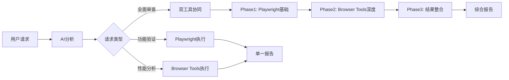

# 🎯 通用Web项目审查系统 - AI执行规则

> **版本**: v2.0 - Universal Web Project Auditor  
> **设计目标**: 智能识别、自动适配、系统化审查任意Web项目  
> **适用范围**: 所有现代Web应用 (Vue/React/Angular/Svelte/原生JS)  
> **核心特性**: 零配置、自动识别、框架特定优化建议

---

## 📋 核心执行原则

### 🤖 AI智能决策规则
```markdown
1. 执行前必须搜索：使用search_memory_nodes和search_memory_facts查找相关偏好和程序
2. 用户发出审查请求时，AI自动分析请求类型
3. 根据关键词智能选择工具组合和执行顺序
4. 无需用户手动切换工具或服务
5. 所有工具可同时保持运行状态
6. AI负责协调工具间的数据传递和结果整合
7. 立即保存新发现：使用add_memory存储偏好、程序和关键事实
```

### 🧠 Graphiti记忆系统集成
```yaml
执行前搜索（必须）:
  - search_memory_nodes: 查找"Preference"和"Procedure"类型节点
  - search_memory_facts: 搜索项目相关事实和关系
  - 关键词: "项目审查"、"性能优化"、"测试流程"等

执行中记忆（实时）:
  - 发现用户偏好时: 立即add_memory存储
  - 识别最佳实践时: 记录为Procedure类型
  - 发现技术问题时: 保存事实关系

执行后总结（完成）:
  - 将审查结果存储为episode
  - 记录优化建议为可复用的程序
  - 建立项目和问题之间的关系图
```

### 🔄 工具协同执行流程


---

## 🎯 智能触发规则

### 关键词识别矩阵
| 用户输入包含 | 触发工具 | 执行模式 | 预期时长 |
|-------------|----------|----------|----------|
| `审查`、`全面`、`评估` | Playwright + Browser Tools | 协同执行 | 8-12分钟 |
| `功能`、`测试`、`验证` | Playwright | 单独执行 | 2-3分钟 |
| `性能`、`优化`、`lighthouse` | Browser Tools | 单独执行 | 5-8分钟 |
| `可访问性`、`a11y`、`无障碍` | Browser Tools | 专项执行 | 3-5分钟 |
| `SEO`、`搜索优化` | Browser Tools | 专项执行 | 3-5分钟 |

### 执行决策逻辑
```javascript
// AI内部决策逻辑（伪代码）
function decideExecutionStrategy(userQuery) {
    const query = userQuery.toLowerCase();
    
    // 全面审查触发词
    if (query.includes('审查') || query.includes('全面') || 
        query.includes('评估') || query.includes('检测')) {
        return {
            mode: 'comprehensive',
            tools: ['playwright', 'browser-tools'],
            sequence: 'playwright-first'
        };
    }
    
    // 功能测试触发词
    if (query.includes('功能') || query.includes('测试') || 
        query.includes('验证') || query.includes('交互')) {
        return {
            mode: 'functional',
            tools: ['playwright'],
            sequence: 'single'
        };
    }
    
    // 性能分析触发词
    if (query.includes('性能') || query.includes('优化') || 
        query.includes('速度') || query.includes('lighthouse')) {
        return {
            mode: 'performance', 
            tools: ['browser-tools'],
            sequence: 'single'
        };
    }
    
    // 默认：全面审查
    return {
        mode: 'comprehensive',
        tools: ['playwright', 'browser-tools'],
        sequence: 'playwright-first'
    };
}
```

## ⚡ 具体执行策略

### Phase 1: 项目识别与基础审查（自动执行）
```yaml
项目类型自动识别:
  1. 读取package.json分析项目特征:
     - 框架检测: Vue/React/Angular/Svelte/原生JS
     - UI库识别: Element Plus/Ant Design/Material UI/Bootstrap
     - 构建工具: Vite/Webpack/Next.js/Create React App
     - 包管理器: 检测lock文件类型 (pnpm-lock/yarn.lock/package-lock)
  
  2. 智能启动命令选择:
     - 脚本优先级: dev > start > serve > preview
     - 包管理器优先级: 项目锁文件对应的 > pnpm > yarn > npm
     - 自动组合: 如 "pnpm dev" / "npm run start" / "yarn serve"
  
  3. 动态端口识别:
     - 从启动输出自动识别端口 (3000/5173/8080等)
     - 支持动态端口分配
     - 等待服务器ready信号

执行步骤:
  1. 项目环境准备:
     - 自动检测并执行对应的启动命令
     - 等待开发服务器完全启动
     - 验证服务器可访问性
  
  2. 核心页面导航测试:
     - 访问根路径 "/"
     - 检查页面加载完成状态
     - 验证无404/500/网络错误
  
  3. 通用功能验证:
     - 页面基本渲染正确性
     - 主要交互元素响应 (链接、按钮、输入框)
     - 路由系统正常性 (SPA路由跳转)
     - 表单基础功能 (如有)
  
  4. 跨设备响应式测试:
     - 桌面端 (1920x1080) - 完整布局验证
     - 平板端 (768x1024) - 中等屏幕适配
     - 移动端 (375x667) - 小屏幕优化
  
  5. 基础性能数据收集:
     - 首屏加载时间 (FCP, LCP指标)
     - 资源加载统计 (JS/CSS/图片数量和大小)
     - JavaScript运行错误监控
     - 网络请求成功率统计

工具调用序列:
  - read_file("package.json"): 分析项目类型
  - run_terminal_cmd("智能启动命令"): 启动开发服务器
  - 等待服务器就绪信号
  - 执行多视口浏览器测试
  - 收集性能和错误数据

输出数据:
  - 项目类型识别报告 (框架/UI库/构建工具)
  - 功能完整性评分 (0-100)
  - 跨平台兼容性分析
  - 基础性能指标汇总
  - 发现的问题列表 (按严重程度排序)
```

### Phase 2: Browser Tools深度分析（条件执行）
```yaml
执行条件: 
  - Phase 1 无严重功能问题 或 用户明确要求
  - Browser Tools服务(localhost:3025)可用

前置检查:
  - 验证Browser Connector Server运行状态
  - 确认用户浏览器已安装Browser Tools扩展
  - 检查当前浏览器标签页是否访问了目标应用

执行步骤:
  1. Lighthouse性能审计:
     - 调用 mcp_browser-tools_runPerformanceAudit
     - Core Web Vitals评分 (LCP, FID/INP, CLS)
     - 性能优化建议 (资源压缩、缓存策略)
     - 资源加载分析 (关键渲染路径)
  2. 可访问性专业评估:
     - 调用 mcp_browser-tools_runAccessibilityAudit
     - WCAG 2.1合规性检查 (A, AA, AAA级别)
     - 键盘导航测试 (Tab键顺序、焦点管理)
     - 屏幕阅读器兼容性 (alt标签、aria属性)
  3. SEO标准检查:
     - 调用 mcp_browser-tools_runSEOAudit
     - Meta标签完整性 (title, description, keywords)
     - 结构化数据 (JSON-LD, Schema.org)
     - 移动友好度 (viewport, 响应式图片)
  4. 最佳实践审计:
     - 调用 mcp_browser-tools_runBestPracticesAudit
     - 安全性检查 (HTTPS, CSP, HSTS)
     - 现代Web标准符合度 (ES6+, CSS Grid/Flexbox)
     - 浏览器兼容性 (跨浏览器测试)

工具调用序列:
  - mcp_browser-tools_runPerformanceAudit()
  - mcp_browser-tools_runAccessibilityAudit() 
  - mcp_browser-tools_runSEOAudit()
  - mcp_browser-tools_runBestPracticesAudit()
  - mcp_browser-tools_takeScreenshot() (记录当前状态)

输出数据:
  - Lighthouse综合评分 (0-100 x 4个维度)
  - 可访问性等级评定 (WCAG合规级别)
  - SEO优化评分 (搜索引擎友好度)
  - 具体优化建议列表 (按影响程度排序)
  - 性能瓶颈详细分析
  - 兼容性问题报告
```

### Phase 3: 智能报告生成（自动执行）
```yaml
数据融合策略:
  1. 交叉验证两个工具的共同指标
  2. 合并去重优化建议
  3. 按影响程度排序问题优先级
  4. 生成可执行的改进方案

报告结构:
  - 执行摘要 (30秒快速了解)
  - 关键问题 (需要立即处理)  
  - 性能详情 (技术团队参考)
  - 优化建议 (分优先级执行)
  - 对比基准 (行业标准比较)
```

---

## 📊 报告模板标准

### 通用Web项目审查报告格式
```markdown
# 🎯 Web项目审查报告

## ⚡ 项目概览
- **项目类型**: {framework} + {uiLibrary} + {buildTool}
- **包管理器**: {packageManager}
- **启动命令**: {startCommand}
- **服务器地址**: {serverUrl}

## ⚡ 执行摘要
- **总体评分**: X/100 (等级)
- **执行用时**: X分钟
- **审查范围**: 功能 + 性能 + 可访问性 + SEO
- **发现问题**: N个需要关注的问题

## 🔧 基础功能分析 (通用测试)
### ✅ 正常功能
- 项目启动: {startCommand} 成功运行
- 页面渲染: 首页正常加载和显示  
- 路由系统: 页面跳转功能正常
- 响应式设计: 多设备适配良好
- 基础交互: 链接、按钮响应正常

### ⚠️ 发现问题  
- {具体问题描述} + 影响分析 + {框架特定解决方案}

## 🚀 性能深度分析 (如可用)
### 📈 Core Web Vitals
- **LCP (最大内容绘制)**: X.Xs (评价)
- **FID/INP (交互响应)**: Xms (评价)  
- **CLS (布局稳定性)**: X.XX (评价)

### 🎯 Lighthouse综合评分
- 性能 Performance: X/100
- 可访问性 Accessibility: X/100  
- 最佳实践 Best Practices: X/100
- SEO优化: X/100

## 🎖️ 框架特定优化建议

### 🔥 {Framework}框架优化 - 立即处理
1. **{框架特定问题}**
   - 问题: {具体技术问题}
   - 影响: {对用户/开发的影响}
   - 方案: {框架最佳实践解决方案}
   - 预期效果: {量化改进目标}

### ⚡ {UI库}组件优化 - 近期处理  
2. **{UI库特定建议}**
   - 问题: {组件库使用问题}
   - 影响: {性能或体验影响}
   - 方案: {组件库优化策略}
   - 预期效果: {具体改进指标}

### 🎨 {构建工具}配置优化 - 体验提升
3. **{构建工具优化}** 
   - 问题: {构建配置问题}
   - 影响: {开发或部署影响}
   - 方案: {构建工具最佳配置}
   - 预期效果: {构建性能提升}

## 📈 技术栈对比基准
- {框架}项目平均性能: X/100 (当前项目: Y/100)
- {UI库}应用标准可访问性: X/100 (当前应用: Y/100)  
- {构建工具}构建速度基准: Xs (当前: Ys)
- **推荐状态**: {基于技术栈的具体建议}

## 🔧 框架生态系统建议
### {Framework}生态优化
- 状态管理: {推荐的状态管理方案}
- 路由方案: {路由优化建议}  
- 性能优化: {框架特定性能策略}
- 测试策略: {推荐测试工具和方法}
```

---

## 🛠️ 异常处理与容错

### 服务可用性检查
```yaml
启动前检查:
  - Playwright: 内置工具，始终可用
  - Browser Tools: 检查localhost:3025连接状态
  
异常处理策略:
  Browser Tools不可用时:
    - 自动回退到Playwright单独执行
    - 在报告中说明限制条件
    - 提供Browser Tools启动指导
  
  Playwright异常时:
    - 尝试Browser Tools单独执行
    - 提供手动测试检查清单
    
  两个工具都异常时:
    - 提供详细的手动审查指南
    - 给出技术支持联系方式
```

### 用户体验优化
```yaml
进度反馈:
  - "🔍 正在进行功能验证..." (Playwright阶段)
  - "⚡ 正在执行性能分析..." (Browser Tools阶段)  
  - "📊 正在生成综合报告..." (整合阶段)

结果呈现:
  - 使用emoji和颜色编码提升可读性
  - 技术问题提供用户友好的解释
  - 优化建议给出具体的执行步骤
  - 包含预期改进效果说明
```

---

## ✨ 使用示例

### 🚀 全面审查 (适配任意Web项目)
```
用户: "帮我全面审查这个项目" 
→ AI自动识别项目类型 (Vue/React/Angular等)
→ 智能选择启动命令 (pnpm dev/npm start/yarn serve)  
→ 执行通用功能测试 + 深度性能分析
→ 生成框架特定的优化建议 (8-12分钟)

支持项目类型:
✅ Vue 3 + Vite + Element Plus/Ant Design
✅ React + CRA/Next.js + Material UI/Ant Design  
✅ Angular + CLI + Angular Material
✅ Svelte + SvelteKit + Carbon/Bulma
✅ 原生JS + Webpack/Vite + Bootstrap
```

### ⚡ 快速功能验证
```
用户: "检查功能是否正常"
→ AI智能启动开发服务器
→ 执行跨设备基础功能测试
→ 生成框架无关的功能报告 (2-3分钟)

自动适配:
- 包管理器: npm/yarn/pnpm
- 启动脚本: dev/start/serve/preview
- 端口检测: 3000/5173/8080/4200等
```

### 🎯 专业性能分析  
```
用户: "分析页面性能"
→ AI执行Lighthouse全面审计
→ 生成技术栈特定的性能报告 (5-8分钟)

框架特定优化:
- Vue: Composition API、Tree Shaking建议
- React: Hooks优化、代码分割策略  
- Angular: Zone.js优化、AOT编译建议
- 通用: Core Web Vitals、资源优化
```

### 智能项目适配逻辑
```javascript
// 项目类型检测函数
async function detectProjectConfig() {
    // 1. 读取并分析 package.json
    const pkg = await read_file("package.json");
    const packageData = JSON.parse(pkg);
    
    // 2. 检测框架类型
    const framework = detectFramework(packageData);
    const uiLibrary = detectUILibrary(packageData);
    const buildTool = detectBuildTool(packageData);
    
    // 3. 检测包管理器
    const packageManager = await detectPackageManager();
    
    // 4. 构建启动命令
    const startCommand = buildStartCommand(packageManager, packageData.scripts);
    
    return {
        framework,      // "vue" | "react" | "angular" | "svelte" | "vanilla"
        uiLibrary,      // "element-plus" | "ant-design" | "material-ui" | etc
        buildTool,      // "vite" | "webpack" | "next" | "create-react-app"
        packageManager, // "pnpm" | "yarn" | "npm"
        startCommand    // "pnpm dev" | "npm start" | "yarn dev"
    };
}

// 通用审查流程
async function comprehensiveReview() {
    // Phase 1: 智能项目识别和基础审查
    const config = await detectProjectConfig();
    await run_terminal_cmd(config.startCommand);  // 动态启动命令
    
    // 等待服务器启动并自动检测端口...
    const serverUrl = await waitForServerReady();
    
    // 执行框架无关的功能测试
    await runUniversalFunctionalTests(serverUrl, config);
    
    // Phase 2: Browser Tools深度分析 (如果可用)
    if (await checkBrowserToolsAvailable()) {
        await mcp_browser-tools_runPerformanceAudit();
        await mcp_browser-tools_runAccessibilityAudit();
        await mcp_browser-tools_runSEOAudit();
        await mcp_browser-tools_runBestPracticesAudit();
        await mcp_browser-tools_takeScreenshot();
    }
    
    // Phase 3: 生成适配性报告
    return generateUniversalReport(config);
}

// 框架特定的优化建议
function getFrameworkSpecificAdvice(framework, issues) {
    const adviceMap = {
        'vue': generateVueAdvice(issues),
        'react': generateReactAdvice(issues),
        'angular': generateAngularAdvice(issues),
        'svelte': generateSvelteAdvice(issues)
    };
    
    return adviceMap[framework] || generateGenericAdvice(issues);
}
```

---

## 🔄 持续优化机制

### 规则自我进化
```yaml
学习机制:
  - 收集用户反馈优化执行策略
  - 基于项目类型调整检查重点
  - 根据行业标准更新评分基准
  
更新频率:
  - 工具能力: 随工具更新而更新
  - 执行策略: 每月基于使用数据优化
  - 报告模板: 基于用户反馈持续改进
```

### 扩展性设计
```yaml
新工具集成:
  - 提供标准接口规范
  - 支持插件式工具添加
  - 保持向后兼容性

自定义规则:
  - 允许项目特定规则覆盖
  - 支持团队标准定制
  - 提供规则验证机制
```

---

## 🚀 规则激活指南

### 💾 保存配置
1. **方法1**: 将此文件内容复制到项目根目录的 `.cursorrules` 文件
2. **方法2**: 在对话中引用这个1.md文件
3. **方法3**: 直接对AI说"按照1.md的规则执行"

### ⚡ 万能测试指令 (适配所有Web项目)
```bash
# 🌟 通用全面审查 - 自动识别任何Web项目
"全面审查这个项目"
"帮我审查这个Web应用"
"评估项目质量"

# ⚡ 快速功能检查 - 支持任何框架
"检查功能是否正常" 
"测试基础功能"
"验证应用可用性"

# 🎯 专业性能分析 - 框架特定优化
"分析页面性能"
"性能优化建议"  
"检查Core Web Vitals"

# 🔧 特定技术栈审查 (可选指定)
"审查这个React项目"
"检查Vue应用性能"
"分析Angular项目"
```

### 🎯 智能适配能力
```yaml
自动识别支持:
  - 📦 包管理器: npm, yarn, pnpm
  - 🎨 前端框架: Vue, React, Angular, Svelte, 原生JS
  - 🧩 UI组件库: Element Plus, Ant Design, Material UI, Bootstrap
  - 🛠️ 构建工具: Vite, Webpack, Create React App, Angular CLI
  - 🚀 启动方式: dev, start, serve, preview, build
  - 🌐 开发端口: 3000, 5173, 8080, 4200, 自动检测

无需手动配置:
  - ✅ 自动读取 package.json 识别技术栈
  - ✅ 智能选择最佳启动命令 
  - ✅ 动态检测开发服务器端口
  - ✅ 生成框架特定的优化建议
```

### 📊 预期结果
- **执行时间**: 2-12分钟不等
- **报告格式**: 标准化Markdown格式
- **包含内容**: 评分、问题、建议、对比基准
- **操作指南**: 具体可执行的优化步骤

---

## ✅ 规则完整性验证清单

### 📋 必需组件检查
- [x] **触发词识别**: 明确的关键词匹配表
- [x] **工具调用**: 具体的函数名和参数 
- [x] **执行流程**: 详细的步骤说明
- [x] **异常处理**: 完整的容错机制
- [x] **报告模板**: 标准化输出格式
- [x] **记忆集成**: Graphiti系统集成
- [x] **实际示例**: 可执行的代码样例

### 🎯 规则可执行性确认
```bash
✅ AI能识别用户意图 (关键词矩阵)
✅ AI知道调用什么工具 (具体函数名)
✅ AI知道执行顺序 (Phase 1→2→3)
✅ AI能处理异常情况 (回退策略)
✅ AI能生成标准报告 (模板格式)
✅ AI能记忆和学习 (Graphiti集成)
```

---

**🎯 现在就可以使用**: 对AI说 "按照1.md规则全面审查项目" 立即体验通用审查！

**🚀 零配置体验**: 无需指定框架类型，AI自动识别Vue/React/Angular等任意Web项目！

**🔧 问题反馈**: 如规则执行异常，请描述具体情况以便优化规则！

**📝 规则状态**: ✅ v2.0通用版 - 支持所有Web项目 - 可直接执行
