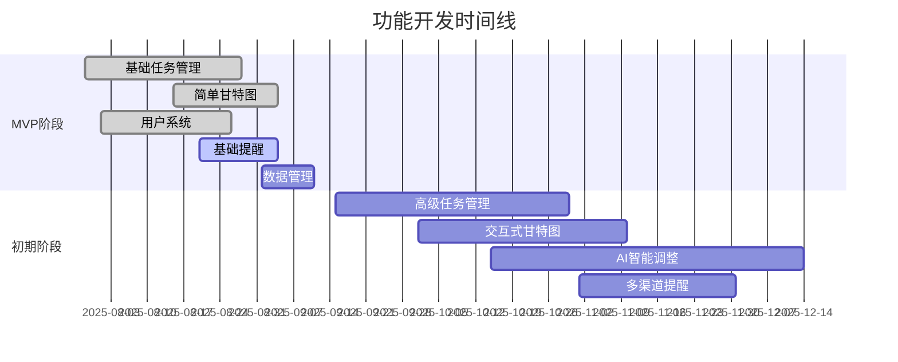

# 🚀 智能提醒事项Web App - 功能梳理文档

## 🔗 相关文档链接

- [技术架构设计](./技术架构.md) - 查看技术实现方案
- [API接口文档](./API文档.md) - 查看功能对应的API接口
- [数据库表结构](./数据库表_实际结构.md) - 查看功能对应的数据表设计
- [开发进度跟踪](./当前开发进度.md) - 查看功能开发进度

## 📊 开发阶段规划

### 🎯 四阶段发展策略

| 阶段 | 时间 | 目标 | 用户规模 | 核心功能 |
|------|------|------|----------|----------|
| 🔥 **MVP** | 0-3个月 | 验证产品价值 | 100-1K | 基础任务管理、简单甘特图 |
| 🚀 **初期** | 3-12个月 | 功能完善 | 1K-10万 | AI智能调整、交互式甘特图 |
| ⚡ **中期** | 1-3年 | 规模化发展 | 10万-100万 | 企业功能、高级分析 |
| 🌍 **长期** | 3-5年 | 企业级平台 | 100万+ | 全球化、开放平台 |

---

## 📋 项目概述

**项目定位**: 集成**交互式甘特图**、**AI智能调整**和**多维度提醒**的个人任务管理Web应用

### 核心创新点
- 🎯 **交互式甘特图**: 可视化时间管理，拖拽调整任务
- 🤖 **AI智能助手**: 冲突检测、智能调整、习惯学习
- 💻 **技术人员友好**: Markdown支持、快捷键、代码高亮
- 📱 **多平台提醒**: Web、邮件、移动端推送集成

### 目标用户
- **主要用户**: 程序员、IT从业者、计算机学生
- **使用场景**: 项目规划、多任务管理、长期目标跟踪
- **技术特点**: 熟悉新技术，需要专业级功能

---

## 🔧 核心功能清单

### 🔥 MVP阶段（0-3个月）
| 模块 | 核心功能 | 状态 |
|------|----------|------|
| **任务管理** | CRUD操作、分类、优先级、状态管理 | ✅ |
| **甘特图** | 基础展示、时间轴可视化、简单拖拽 | ✅ |
| **用户系统** | 注册登录、基础信息、偏好设置 | ✅ |
| **提醒系统** | 网页提醒、时间设置、重复规则 | ✅ |
| **数据管理** | 云端存储、数据同步、基础导出 | ✅ |

### 🚀 初期阶段（3-12个月）
| 模块 | 核心功能 | 状态 |
|------|----------|------|
| **高级任务** | 多级分类、标签、依赖关系、模板 | ✅ |
| **交互甘特图** | 多视图、完整拖拽、依赖连线、冲突检测 | ✅ |
| **AI智能** | 冲突检测、智能调整、习惯学习 | ✅ |
| **多渠道提醒** | 浏览器推送、邮件、自定义时间 | ✅ |
| **技术特色** | Markdown支持、代码高亮、快捷键 | ✅ |

### ⚡ 中期阶段（1-3年）
| 模块 | 核心功能 | 状态 |
|------|----------|------|
| **高级AI** | 深度学习、智能规划、自然语言交互 | ⏳ |
| **企业功能** | 多租户、团队协作、权限管理 | ⏳ |
| **数据分析** | 效率分析、生产力报告、趋势预测 | ⏳ |
| **移动端** | PWA支持、离线功能、移动优化 | ⏳ |
| **第三方集成** | GitHub、邮件日历、Slack等 | ⏳ |

### 🌍 长期阶段（3-5年）
| 模块 | 核心功能 | 状态 |
|------|----------|------|
| **全球化** | 多语言、多时区、本地化部署 | ⏳ |
| **开放平台** | API市场、开发者工具、生态建设 | ⏳ |
| **商业化** | 订阅管理、合作伙伴、白标方案 | ⏳ |
| **大数据** | 数据湖、机器学习、智能分析 | ⏳ |

---

## 🚀 功能优先级

| 优先级 | 功能模块 | 状态 | 说明 |
|--------|----------|------|------|
| **P0** | 基础任务管理、用户系统、简单甘特图 | ✅ | MVP必需功能 |
| **P1** | 交互甘特图、AI智能调整、多渠道提醒 | ✅ | 核心差异化功能 |
| **P2** | 高级AI、数据分析、Markdown支持 | ⏳ | 增强功能 |
| **P3** | 团队协作、移动端、第三方集成 | ⏳ | 未来扩展功能 |

---

## 📊 核心用户故事

### 🎯 甘特图可视化（核心差异化）
- 用户希望在甘特图中直观看到任务时间安排
- 用户希望通过拖拽灵活调整任务时间
- 用户希望看到任务状态的颜色区分

### 🤖 AI智能助手（核心差异化）
- 用户希望AI自动检测时间冲突
- 用户希望AI智能重新安排任务
- 用户希望AI解释调整原因和建议

### 📋 任务管理（基础功能）
- 用户希望创建详细的任务信息
- 用户希望对任务进行分类和搜索
- 用户希望设置多种提醒方式

---

## 📝 核心业务流程

### 任务创建流程
```
登录 → 创建任务 → AI冲突检测 → 确认保存 → 更新甘特图
```

### AI调整流程
```
变化反馈 → AI分析 → 生成方案 → 展示理由 → 确认执行
```

---

## 🎯 验收标准

### MVP版本验收标准 ✅
- 用户注册登录、任务CRUD、甘特图展示、基础提醒、时间冲突检测

### 完整版本验收标准
- AI智能调整、交互式甘特图、多渠道提醒、数据分析、性能达标

---

## 📈 核心成功指标

### 用户指标
- **注册转化率** > 60%
- **日活留存率** > 40%
- **任务完成率** > 80%

### 功能指标
- **甘特图使用率** > 70%
- **AI功能使用率** > 50%
- **提醒及时性** > 99%

### 性能指标
- **页面加载时间** < 3秒
- **API响应时间** < 300ms
- **系统可用性** > 99.9%

### 满意度指标
- **应用评分** > 4.5星
- **用户满意度** > 85%
- **功能满意度** > 90%

## 📊 功能开发进度可视化



---

## 📝 更新记录

| 版本 | 日期 | 更新人 | 变更说明 |
|------|------|--------|----------|
| v1.0 | 2025-07-29 | AreaSong | 初始版本创建，完整功能需求梳理 |

### 更新频率说明
- **定期更新**: 每月评估一次功能优先级
- **需求变更**: 用户反馈导致的功能调整时更新
- **阶段评审**: 每个开发阶段结束后更新完成状态

### 功能与技术实现映射
本文档中的功能模块与技术实现的对应关系：

- **基础任务管理** → [API接口](./API文档.md#任务管理api) → [数据库表](./数据库表_实际结构.md#任务管理表)
- **甘特图可视化** → [时间线API](./API文档.md#时间线管理api) → [时间线表](./数据库表_实际结构.md#时间线管理表)
- **AI智能调整** → [技术架构](./技术架构.md#ai集成) → AI服务集成
- **提醒系统** → [提醒API](./API文档.md#提醒系统api) → [提醒表](./数据库表_实际结构.md#提醒系统表)
