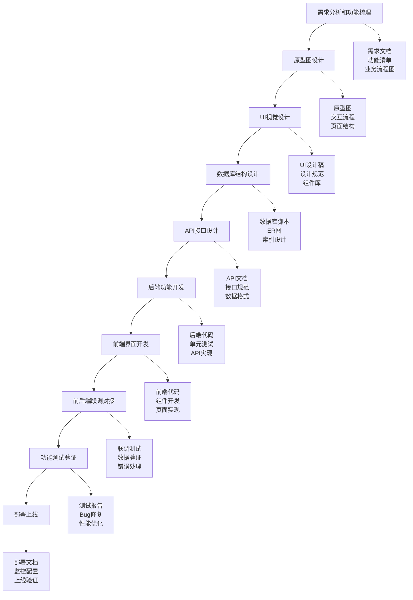

# 🚀 Web应用开发流程实施指南

## 🔗 相关文档链接

- [技术架构文档](./技术架构.md) - 查看技术选型和架构设计
- [功能需求梳理](./功能梳理.md) - 查看详细功能需求
- [API接口设计](./API文档.md) - 查看接口设计规范
- [数据库设计](./数据库表_实际结构.md) - 查看数据库结构
- [当前开发进度](./当前开发进度.md) - 查看实际执行进度

## 📋 目录

- [开发流程总览](#开发流程总览)
- [第一步：需求分析和功能梳理](#第一步需求分析和功能梳理)
- [第二步：原型图设计](#第二步原型图设计)
- [第三步：UI视觉设计](#第三步ui视觉设计)
- [第四步：数据库结构设计](#第四步数据库结构设计)
- [第五步：API接口设计](#第五步api接口设计)
- [第六步：后端功能开发](#第六步后端功能开发)
- [第七步：前端界面开发](#第七步前端界面开发)
- [第八步：前后端联调对接](#第八步前后端联调对接)
- [第九步：功能测试验证](#第九步功能测试验证)
- [第十步：部署上线](#第十步部署上线)
- [为什么是这个顺序](#为什么是这个顺序)

---

## 🎯 开发流程总览

### 完整开发步骤
```
需求梳理 → 画原型图 → 做UI设计 → 设计数据库 → 设计API → 开发后端 → 开发前端 → 联调测试 → 部署上线
```

### 每步耗时参考
- **需求梳理**: 1-2天
- **原型设计**: 2-3天
- **UI设计**: 3-5天
- **数据库设计**: 1-2天
- **API设计**: 1-2天
- **后端开发**: 15-25天
- **前端开发**: 15-25天
- **联调测试**: 3-5天
- **部署上线**: 1-2天

---

## 📋 开发流程详细步骤

### 第一步：需求分析和功能梳理 ✅
**目标**: 明确要做什么功能，确定用户角色和业务流程
**输出**: 需求文档、功能清单、业务流程图、用户角色定义
**耗时**: 1-2天

### 第二步：原型图设计
**目标**: 画出页面基本结构，确定页面跳转关系
**输出**: 原型图、交互流程图、页面结构图
**耗时**: 2-3天

### 第三步：UI视觉设计
**目标**: 设计美观的界面，制定设计规范
**输出**: UI设计稿、设计规范、组件库
**耗时**: 3-5天

### 第四步：数据库结构设计 ✅
**目标**: 设计数据表结构，优化查询性能
**输出**: 数据库脚本、ER图、索引设计
**耗时**: 1-2天

### 第五步：API接口设计 ✅
**目标**: 设计RESTful API，定义数据格式
**输出**: API文档、接口规范、数据格式定义
**耗时**: 1-2天

### 第六步：后端功能开发 🔄 进行中
**目标**: 实现业务逻辑，开发API接口
**输出**: 后端代码、单元测试、API实现
**耗时**: 15-25天
**当前状态**: 三层架构和Entity Framework Core配置已完成，所有控制器依赖注入优化完成，正在进行API功能测试

### 第七步：前端界面开发
**目标**: 实现用户界面，对接API
**输出**: 前端代码、组件开发、页面实现
**耗时**: 15-25天

### 第八步：前后端联调对接
**目标**: 前后端集成，数据流验证
**输出**: 联调测试、数据验证、错误处理
**耗时**: 3-5天

### 第九步：功能测试验证
**目标**: 全面测试，修复问题
**输出**: 测试报告、Bug修复、性能优化
**耗时**: 3-5天

### 第十步：部署上线
**目标**: 部署到生产环境，监控运行
**输出**: 部署文档、监控配置、上线验证
**耗时**: 1-2天

2. **设计交互流程**
   - 用户点击按钮后发生什么
   - 表单提交后跳转到哪里
   - 错误时如何提示用户

3. **画低保真原型**
   - 用线框图的方式
   - 不考虑美观，只考虑功能
   - 重点是交互逻辑

### 使用工具
- Figma（推荐）
- 墨刀
- Axure
- 画图软件

### 输出成果
- 低保真原型图
- 页面跳转流程图
- 交互说明文档

---

## 🎨 第三步：UI视觉设计

### 做什么
- 确定应用的视觉风格
- 设计所有页面的最终样式
- 制作设计规范

### 具体操作
1. **确定设计风格**
   - 选择配色方案
   - 确定字体样式
   - 定义组件风格

2. **设计页面样式**
   - 根据原型图做美化
   - 保证视觉统一性
   - 考虑不同设备的适配

3. **制作设计规范**
   - 颜色规范
   - 字体规范
   - 组件规范
   - 间距规范

### 输出成果
- 高保真设计稿
- 设计规范文档
- 切图素材
- 图标资源

---

## 🗃️ 第四步：数据库结构设计

### 做什么
- 分析需要存储哪些数据
- 设计数据表结构
- 确定表之间的关系

### 具体操作
1. **分析数据需求**
   - 从功能需求中提取数据
   - 确定数据的属性
   - 分析数据之间的关系

2. **设计表结构**
   - 确定需要几张表
   - 每张表有哪些字段
   - 字段的数据类型

3. **优化数据库设计**
   - 考虑查询效率
   - 避免数据冗余
   - 设置合适的索引

### 输出成果
- 数据库设计文档
- ER关系图
- 建表语句
- 数据字典

---

## 🔌 第五步：API接口设计

### 做什么
- 设计前后端交互的接口
- 确定数据传输格式
- 制定接口规范

### 具体操作
1. **梳理接口需求**
   - 前端需要哪些数据
   - 需要向后端发送什么数据
   - 哪些操作需要接口支持

2. **设计接口规范**
   - 接口的命名规则
   - 请求和响应的数据格式
   - 错误处理方式

3. **编写接口文档**
   - 每个接口的详细说明
   - 参数说明和示例
   - 测试用例

### 输出成果
- API接口文档
- 数据格式规范
- 接口测试用例

---

## ⚙️ 第六步：后端功能开发（企业级ASP.NET Core架构）🔄 进行中

### 做什么
- 搭建企业级三层架构后端开发环境
- 实现完整的业务逻辑层和数据访问层
- 配置JWT认证、Entity Framework Core和依赖注入
- 实现所有RESTful API接口

### 当前进度状态 (2025-08-03更新)
- ✅ 基础项目结构已创建
- ✅ 三层架构完善已完成
- ✅ Entity Framework Core配置已完成
- ✅ 所有控制器依赖注入优化完成
- ✅ TaskCategoryController API功能验证通过
- 🔄 JWT认证系统完善进行中
- 🔄 API功能测试进行中
- ⏳ 前后端集成待开始

### 📊 今日完成成果 (2025-08-03)
- ✅ **TaskCategoryController优化**: 依赖注入修复 + API测试验证
- ✅ **UserController优化**: 4个API方法依赖注入修复
- ✅ **TaskController优化**: 5个API方法依赖注入修复
- ✅ **数据库连接验证**: SQL Server Express连接正常
- ✅ **应用程序启动**: 编译0错误，运行正常
- ✅ **Swagger文档**: API端点正确加载和显示
- ✅ **项目进度提升**: 从32.9%提升到52.9% (+20%)

### 6.1 项目结构搭建（企业级标准）

#### 创建解决方案结构
```
ToDoListArea/
├── src/
│   ├── ToDoListArea.API/              # Web API项目（表示层）
│   │   ├── Controllers/               # API控制器
│   │   ├── Middleware/                # 自定义中间件
│   │   ├── Extensions/                # 服务扩展
│   │   ├── Filters/                   # 过滤器
│   │   └── Program.cs                 # 应用启动配置
│   │
│   ├── ToDoListArea.Core/             # 核心业务层
│   │   ├── Entities/                  # 实体模型
│   │   ├── Interfaces/                # 服务接口
│   │   │   ├── Services/              # 业务服务接口
│   │   │   └── Repositories/          # 仓储接口
│   │   ├── Services/                  # 业务服务实现
│   │   ├── DTOs/                      # 数据传输对象
│   │   ├── Enums/                     # 枚举定义
│   │   ├── Exceptions/                # 自定义异常
│   │   └── Validators/                # 数据验证器
│   │
│   ├── ToDoListArea.Infrastructure/   # 基础设施层
│   │   ├── Data/                      # 数据访问
│   │   │   ├── Context/               # DbContext
│   │   │   ├── Configurations/        # 实体配置
│   │   │   ├── Repositories/          # 仓储实现
│   │   │   └── Migrations/            # 数据库迁移
│   │   ├── Services/                  # 外部服务实现
│   │   │   ├── Email/                 # 邮件服务
│   │   │   ├── Cache/                 # 缓存服务
│   │   │   └── Storage/               # 文件存储服务
│   │   └── Extensions/                # 基础设施扩展
│   │
│   └── ToDoListArea.Shared/           # 共享库
│       ├── Constants/                 # 常量定义
│       ├── Helpers/                   # 帮助类
│       ├── Extensions/                # 通用扩展方法
│       └── Models/                    # 共享模型
│
├── tests/                             # 测试项目
│   ├── ToDoListArea.UnitTests/        # 单元测试
│   ├── ToDoListArea.IntegrationTests/ # 集成测试
│   └── ToDoListArea.ApiTests/         # API测试
│
└── docs/                              # 项目文档
    ├── api/                           # API文档
    └── deployment/                    # 部署文档
```

#### 具体创建步骤说明

**解决方案结构创建**：
- 创建ToDoListArea根目录作为解决方案容器
- 使用dotnet CLI创建.sln解决方案文件统一管理所有项目
- 建立src、tests、docs三个主要目录分别存放源码、测试和文档

**各层项目创建策略**：
- API层：使用webapi模板创建ASP.NET Core Web API项目，作为应用程序的入口点
- Core层：使用classlib模板创建类库项目，包含业务逻辑、实体模型和接口定义
- Infrastructure层：使用classlib模板创建基础设施层，包含数据访问、外部服务集成
- Shared层：使用classlib模板创建共享库，包含通用工具类、常量定义、扩展方法

**测试项目架构**：
- UnitTests：单元测试项目，测试业务逻辑和核心功能
- IntegrationTests：集成测试项目，测试各层之间的集成和数据库操作
- ApiTests：API测试项目，测试Web API接口的功能和性能

**项目引用关系设计**：
- API层引用Core、Infrastructure、Shared三层，作为应用程序的组合根
- Infrastructure层引用Core和Shared层，实现业务接口和共享功能
- Core层仅引用Shared层，保持业务逻辑的纯净性
- 测试项目根据测试范围引用相应的业务项目

### 6.2 NuGet包依赖管理策略

#### API项目依赖包选择

**认证授权包**：
- Microsoft.AspNetCore.Authentication.JwtBearer：提供JWT Bearer认证支持
- Microsoft.AspNetCore.Identity.EntityFrameworkCore：集成ASP.NET Core Identity用户管理系统

**API文档和验证包**：
- Swashbuckle.AspNetCore：自动生成Swagger API文档和测试界面
- FluentValidation.AspNetCore：提供强大的模型验证功能，支持复杂业务规则

**日志和映射包**：
- Serilog.AspNetCore和Serilog.Sinks.File：结构化日志记录，支持文件输出
- AutoMapper.Extensions.Microsoft.DependencyInjection：对象映射工具，简化DTO转换

**跨域和健康检查包**：
- Microsoft.AspNetCore.Cors：跨域资源共享支持
- Microsoft.Extensions.Diagnostics.HealthChecks：应用健康检查功能

#### Infrastructure项目依赖包选择

**Entity Framework Core包**：
- Microsoft.EntityFrameworkCore.SqlServer：SQL Server数据库提供程序
- Microsoft.EntityFrameworkCore.Tools：数据库迁移和脚手架工具
- Microsoft.EntityFrameworkCore.Design：设计时工具支持

**配置管理包**：
- Microsoft.Extensions.Configuration系列：配置文件读取和管理
- Microsoft.Extensions.DependencyInjection：依赖注入容器支持

**缓存和后台任务包**：
- Microsoft.Extensions.Caching系列：内存缓存和Redis分布式缓存
- Hangfire系列：后台任务调度和处理框架

#### Core项目依赖包选择

**身份验证和验证包**：
- Microsoft.AspNetCore.Identity.EntityFrameworkCore：Identity系统核心功能
- FluentValidation：业务规则验证框架

**工具类包**：
- AutoMapper：对象映射工具
- Microsoft.Extensions.DependencyInjection.Abstractions：依赖注入抽象接口

### 6.3 Entity Framework Core配置实现

#### 步骤1: 创建实体模型设计

**User实体设计要点**：
- 继承ASP.NET Core Identity的IdentityUser基类，使用Guid作为主键类型
- 扩展用户基本信息字段：FirstName、LastName、Avatar头像、Timezone时区、Language语言偏好
- 添加业务状态字段：IsActive活跃状态、IsDeleted软删除标记
- 包含审计字段：CreatedAt创建时间、UpdatedAt更新时间、LastLoginAt最后登录时间
- 建立导航属性：与Tasks任务、Reminders提醒、UserProfile用户资料的关联关系

**Task实体设计要点**：
- 使用Guid作为主键，确保全局唯一性
- 核心任务信息：Title标题、Description描述、StartTime开始时间、EndTime结束时间
- 工时管理：EstimatedHours预估工时、ActualHours实际工时
- 状态管理：Priority优先级枚举、Status状态枚举、Progress进度百分比
- 分类标签：Category分类、Tags标签（JSON格式存储）、Color颜色标识
- 重复任务：IsRecurring重复标记、RecurrenceRule重复规则（JSON格式）
- 层级关系：ParentTaskId父任务ID，支持任务的层级结构
- 审计和软删除：IsDeleted、CreatedAt、UpdatedAt、CompletedAt等时间戳字段

**枚举类型设计**：
- TaskStatus枚举：Pending待处理、InProgress进行中、Completed已完成、Cancelled已取消、OnHold暂停
- TaskPriority枚举：Low低优先级、Medium中等优先级、High高优先级、Urgent紧急

#### 步骤2: 创建DbContext设计

**DbContext继承策略**：
- 继承IdentityDbContext基类，集成ASP.NET Core Identity功能
- 使用泛型参数指定User实体和Guid主键类型
- 通过构造函数注入DbContextOptions配置数据库连接

**DbSet集合定义**：
- 为所有23个业务表定义对应的DbSet属性
- 核心业务表：Tasks任务、Reminders提醒、TaskCategories任务分类
- 用户相关表：UserProfiles用户资料、UserActivities用户活动、UserSessions会话
- 时间线表：TimelineNodes时间线节点、GanttData甘特图数据、TimeBlocks时间块
- 系统表：SystemConfigs系统配置、FeatureFlags功能开关、SystemLogs系统日志

**OnModelCreating配置要点**：
- 调用基类OnModelCreating方法保持Identity配置
- 使用ApplyConfigurationsFromAssembly自动应用所有实体配置类
- 重命名Identity表名与数据库脚本保持一致（users、roles、user_roles等）
- 配置全局查询过滤器实现软删除功能
- 设置主键默认值使用NEWID()函数生成Guid
- 配置实体间的级联删除关系

**SaveChangesAsync重写**：
- 自动处理审计字段的更新逻辑
- 在实体添加时自动设置CreatedAt时间戳
- 在实体修改时自动更新UpdatedAt时间戳
- 支持User和Task实体的时间戳自动管理

#### 步骤3: 创建实体配置设计

**UserConfiguration配置要点**：
- 实现IEntityTypeConfiguration接口，提供类型安全的配置方式
- 主键配置：明确指定Id字段为主键
- 字段约束：Email字段必填且最大长度255字符，FirstName和LastName最大长度100字符
- 默认值设置：Timezone默认为UTC，Language默认为zh-CN
- 时间戳配置：CreatedAt和UpdatedAt使用GETDATE()作为默认值
- 索引优化：为Email创建唯一索引，为IsActive和CreatedAt创建普通索引提升查询性能

**TaskConfiguration配置要点**：
- 表名映射：明确指定映射到tasks表
- 字段类型配置：Title必填最大255字符，Description使用NVARCHAR(MAX)支持长文本
- 枚举转换：Priority和Status枚举转换为字符串存储，便于数据库查询和维护
- 数值精度：EstimatedHours和ActualHours使用DECIMAL(5,2)精确存储工时
- JSON字段：Tags和RecurrenceRule使用NVARCHAR(MAX)存储JSON格式数据
- 关系配置：与User的一对多关系使用级联删除，父子任务关系使用NoAction避免循环引用
- 复合索引：创建UserId+Status复合索引优化常用查询场景

**配置类设计原则**：
- 每个实体对应一个独立的配置类，保持职责单一
- 使用Fluent API进行详细的字段和关系配置
- 合理设置索引策略，平衡查询性能和存储空间
- 考虑数据库兼容性，使用标准SQL数据类型

### 6.4 仓储模式设计架构

#### 步骤4: 创建仓储接口设计

**通用仓储接口IRepository<T>设计**：
- 基础CRUD操作：GetByIdAsync根据ID查询、GetAllAsync获取所有记录、AddAsync添加实体、UpdateAsync更新实体、DeleteAsync删除实体
- 条件查询方法：FindAsync基于Lambda表达式的条件查询、FirstOrDefaultAsync获取第一个匹配记录、AnyAsync检查是否存在匹配记录
- 统计功能：CountAsync统计记录数量，支持条件统计
- 批量操作：AddRangeAsync批量添加、UpdateRangeAsync批量更新、DeleteRangeAsync批量删除
- 分页查询：GetPagedAsync支持分页查询，提升大数据集的查询性能
- 异步设计：所有方法均采用异步模式，提升应用程序的并发性能

**任务专用仓储接口ITaskRepository设计**：
- 继承通用仓储接口，获得基础CRUD能力
- 用户任务查询：GetTasksByUserIdAsync获取用户的所有任务
- 状态筛选：GetTasksByStatusAsync根据任务状态筛选
- 时间范围查询：GetTasksByDateRangeAsync查询指定时间范围内的任务
- 逾期任务：GetOverdueTasksAsync查询已逾期的任务
- 全文搜索：SearchTasksAsync支持任务标题和描述的模糊搜索
- 时间冲突检测：HasTimeConflictAsync检查任务时间是否与现有任务冲突
- 层级关系：GetSubTasksAsync获取子任务列表
- 统计分析：GetCompletedTasksCountAsync统计完成任务数量

**工作单元接口IUnitOfWork设计**：
- 仓储聚合：统一管理所有仓储实例（Users、Tasks、Reminders等）
- 事务管理：BeginTransactionAsync开始事务、CommitTransactionAsync提交事务、RollbackTransactionAsync回滚事务
- 变更保存：SaveChangesAsync统一保存所有变更，确保数据一致性
- 资源管理：实现IDisposable接口，确保数据库连接的正确释放

#### 步骤5: 仓储类实现策略

**通用仓储类Repository<T>实现要点**：
- 构造函数注入：接收ToDoListDbContext实例，获取对应的DbSet<T>
- 基础查询方法：实现GetByIdAsync、GetAllAsync、FindAsync等异步查询方法
- 条件查询支持：使用Lambda表达式进行灵活的条件查询
- 异步操作：所有数据库操作均采用异步模式，提升应用性能
- 分页查询：实现GetPagedAsync方法，支持大数据集的分页处理
- 批量操作：提供AddRangeAsync、UpdateRangeAsync、DeleteRangeAsync批量处理能力

**TaskRepository专用仓储实现**：
- 继承通用仓储类，获得基础CRUD功能
- 实现任务特定的查询方法：按用户ID、状态、时间范围查询
- 支持复杂业务查询：逾期任务、全文搜索、时间冲突检测
- 使用Include方法优化关联查询，避免N+1查询问题
- 实现层级任务查询和统计分析功能

**UnitOfWork工作单元实现**：
- 统一管理所有仓储实例，提供一致的数据访问接口
- 实现事务管理功能，确保数据操作的原子性
- 提供SaveChangesAsync方法统一保存所有变更
- 实现IDisposable接口，确保资源的正确释放


### 6.5 JWT认证和Identity配置策略

**JWT配置模型设计**：
- JwtSettings配置类：包含SecretKey密钥、Issuer发行者、Audience受众、ExpirationHours过期时间等配置项
- AuthResult结果模型：统一的认证结果返回格式，包含成功状态、Token、用户信息、错误信息等

**Token服务实现要点**：
- 实现ITokenService接口，提供Token生成、验证、撤销等功能
- 使用JWT标准生成安全的访问令牌，包含用户身份和权限信息
- 支持Refresh Token机制，实现长期登录功能
- 提供Token验证和用户信息提取功能

**认证服务架构**：
- 集成ASP.NET Core Identity用户管理系统
- 实现用户注册、登录、密码管理等完整认证流程
- 支持密码强度验证和安全策略
- 提供忘记密码和密码重置功能
### 6.6 API控制器设计架构

#### 控制器设计原则
**RESTful API设计标准**：
- 遵循HTTP动词语义：GET（查询）、POST（创建）、PUT（更新）、DELETE（删除）
- 统一的URL命名规范：`/api/v1/tasks`、`/api/v1/users/{id}/tasks`
- 标准化的HTTP状态码：200（成功）、201（创建）、400（请求错误）、401（未授权）、404（未找到）、500（服务器错误）

**控制器职责分离**：
- **AuthController**：负责用户认证相关操作（登录、注册、密码重置）
- **TasksController**：负责任务管理的CRUD操作和业务逻辑
- **UsersController**：负责用户信息管理和个人设置
- **RemindersController**：负责提醒系统的管理
- **DashboardController**：负责仪表板数据聚合和统计

**统一响应格式设计**：
- 成功响应：`{ "success": true, "data": {...}, "message": "操作成功" }`
- 错误响应：`{ "success": false, "error": "ERROR_CODE", "message": "错误描述", "details": [...] }`
- 分页响应：包含`totalCount`、`pageNumber`、`pageSize`、`totalPages`等元数据

#### API版本控制策略
**版本控制方案**：
- URL路径版本控制：`/api/v1/tasks`、`/api/v2/tasks`
- 向后兼容性保证：旧版本API至少维护6个月
- 版本弃用通知：通过HTTP头部`X-API-Deprecated`通知客户端

#### 中间件架构设计
**认证授权中间件**：
- JWT Token验证中间件：自动验证请求头中的Bearer Token
- 角色权限中间件：基于用户角色控制API访问权限
- API限流中间件：防止恶意请求和API滥用

**异常处理中间件**：
- 全局异常捕获：统一处理未捕获的异常
- 业务异常转换：将业务异常转换为标准化的API错误响应
- 错误日志记录：详细记录异常信息用于问题排查

**请求响应中间件**：
- 请求日志记录：记录API调用的详细信息
- 响应时间监控：监控API性能指标
- CORS跨域处理：配置跨域访问策略

### 6.7 依赖注入配置策略

#### 服务生命周期管理
**Scoped服务**（请求级别）：
- 数据库上下文（DbContext）：确保每个请求使用独立的数据库连接
- 工作单元（UnitOfWork）：保证事务的一致性
- 业务服务（TaskService、UserService）：维护请求期间的状态一致性

**Singleton服务**（应用级别）：
- 配置服务（IConfiguration）：应用配置信息
- 日志服务（ILogger）：日志记录器
- 缓存服务（IMemoryCache）：内存缓存实例

**Transient服务**（每次注入创建新实例）：
- 工具类和帮助类：无状态的辅助服务
- 外部API客户端：避免连接池问题

#### 配置文件管理策略
**环境配置分离**：
- `appsettings.json`：基础配置和默认值
- `appsettings.Development.json`：开发环境特定配置
- `appsettings.Production.json`：生产环境特定配置
- `appsettings.Staging.json`：测试环境特定配置

**敏感信息管理**：
- 使用User Secrets存储开发环境的敏感配置
- 生产环境使用Azure Key Vault或环境变量
- JWT密钥、数据库连接字符串等敏感信息的安全存储

**配置验证机制**：
- 启动时验证必需的配置项
- 配置格式验证和类型检查
- 配置缺失时的友好错误提示

### 6.8 数据验证和业务规则

#### 输入验证策略
**模型验证**：
- 使用DataAnnotations进行基础验证（必填、长度、格式等）
- FluentValidation进行复杂业务规则验证
- 自定义验证器处理特殊业务场景

**业务规则验证**：
- 任务时间冲突检测：确保用户任务时间不重叠
- 用户权限验证：确保用户只能操作自己的数据
- 数据完整性检查：验证外键关系和数据一致性

#### 错误处理机制
**分层错误处理**：
- 控制器层：处理HTTP相关错误和参数验证错误
- 业务服务层：处理业务逻辑错误和规则违反
- 数据访问层：处理数据库操作错误和约束违反

**错误分类和编码**：
- 系统错误（SYS_xxx）：服务器内部错误、数据库连接失败等
- 业务错误（BIZ_xxx）：业务规则违反、数据冲突等
- 验证错误（VAL_xxx）：输入参数错误、格式不正确等
- 认证错误（AUTH_xxx）：登录失败、权限不足等

### 6.9 性能优化和缓存策略

#### 数据库性能优化
**查询优化**：
- 使用Entity Framework Core的Include方法优化关联查询
- 避免N+1查询问题，使用批量加载
- 合理使用AsNoTracking()提高只读查询性能
- 实现分页查询避免大数据集加载

**索引策略**：
- 为频繁查询的字段创建索引
- 复合索引优化多条件查询
- 定期分析查询执行计划优化性能

#### 缓存实现策略
**多级缓存架构**：
- 一级缓存：Entity Framework Core的变更跟踪缓存
- 二级缓存：应用内存缓存（IMemoryCache）
- 三级缓存：分布式缓存（Redis）用于多实例部署

**缓存策略**：
- 用户信息缓存：缓存用户基本信息和权限数据
- 任务数据缓存：缓存用户的活跃任务列表
- 配置缓存：缓存系统配置和功能开关
- 缓存失效策略：基于时间和事件的缓存更新机制

### 6.10 安全性实现要点

#### 认证安全
**JWT安全配置**：
- 使用强密钥和安全的签名算法（HMAC-SHA256）
- 设置合理的Token过期时间（24小时）
- 实现Refresh Token机制支持长期登录
- Token撤销机制防止已泄露Token的滥用

**密码安全**：
- 使用ASP.NET Core Identity的密码哈希机制
- 强密码策略：最少8位，包含大小写字母、数字和特殊字符
- 密码重置功能的安全实现
- 防止暴力破解的账户锁定机制

#### 数据安全
**输入安全**：
- SQL注入防护：使用参数化查询和Entity Framework Core
- XSS防护：对用户输入进行HTML编码
- CSRF防护：实现防跨站请求伪造机制

**数据传输安全**：
- 强制HTTPS传输加密
- 敏感数据的额外加密存储
- API访问日志记录和监控

### 6.11 测试策略

#### 单元测试
**测试覆盖范围**：
- 业务服务层的核心逻辑测试
- 数据访问层的CRUD操作测试
- 工具类和帮助方法的测试
- 验证器和业务规则的测试

**测试工具选择**：
- xUnit作为测试框架
- Moq用于模拟依赖对象
- FluentAssertions提供更好的断言语法
- AutoFixture生成测试数据

#### 集成测试
**API集成测试**：
- 使用TestServer进行端到端API测试
- 数据库集成测试使用内存数据库或测试数据库
- 认证授权流程的集成测试
- 业务流程的完整性测试

### 6.12 部署和运维考虑

#### 应用配置
**环境配置管理**：
- 使用配置文件和环境变量管理不同环境的配置
- 敏感配置的安全存储和访问
- 配置热更新机制支持运行时配置修改

**健康检查**：
- 实现应用健康检查端点
- 数据库连接健康检查
- 外部依赖服务的健康检查
- 集成到负载均衡器的健康检查机制

#### 监控和日志
**日志策略**：
- 结构化日志记录使用Serilog
- 不同级别的日志记录（Debug、Info、Warning、Error）
- 敏感信息的日志脱敏处理
- 日志聚合和分析系统集成

**性能监控**：
- API响应时间监控
- 数据库查询性能监控
- 内存和CPU使用率监控
- 业务指标监控（用户活跃度、任务完成率等）

---

## 💻 第七步：前端界面开发

**目标**: 实现用户界面，对接后端API
**输出**: 完整前端应用、用户界面、功能交互
**耗时**: 15-25天

### 技术栈
- **React 18 + TypeScript**: 现代前端框架
- **TailwindCSS + HeadlessUI**: 样式和组件库
- **Zustand**: 状态管理
- **React Router 6**: 路由管理
- **Vite**: 构建工具

---

## 🔗 第八步：前后端联调对接
**目标**: 前后端数据交互，解决对接问题
**输出**: 前后端打通、功能正常、用户体验良好
**耗时**: 3-5天

---

## 🧪 第九步：功能测试验证
**目标**: 全面测试，发现修复问题
**输出**: 测试报告、问题修复记录、质量验收
**耗时**: 3-5天

---

## 🚀 第十步：部署上线
**目标**: 部署生产环境，配置监控
**输出**: 部署文档、监控配置、上线验证
**耗时**: 1-2天
---

## 🤔 为什么是这个顺序

### 核心原则
- **设计先行**: 需求→原型→UI→数据库→API，逐步细化
- **后端优先**: 数据支撑前端，接口确定后可并行开发
- **集成验证**: 联调测试发现单独开发时的问题

### 顺序优势
- **风险前置**: 复杂设计工作在前，降低后期风险
- **并行开发**: API确定后，前后端可同时开发
- **问题早发现**: 每阶段都有明确检查点
- **进度可控**: 每步骤都有明确交付物

---

## 📝 总结

**核心思想**: 先思考清楚要做什么，再动手去实现

**流程价值**:
- 减少返工和重复劳动
- 提高开发效率
- 保证项目质量
- 便于团队协作

## 📊 开发流程可视化



---

## 📝 更新记录

| 版本 | 日期 | 更新人 | 变更说明 |
|------|------|--------|----------|
| v1.0 | 2025-07-29 | AreaSong | 初始版本创建，完整开发流程指南 |

### 更新频率说明
- **流程优化**: 根据实际开发经验优化流程步骤
- **工具更新**: 开发工具变更时更新相关章节
- **最佳实践**: 总结开发过程中的最佳实践并更新文档

### 流程执行状态追踪 (2025-08-03更新)
当前项目按照此流程的执行状态，详见 [当前开发进度.md](./当前开发进度.md)：

- ✅ **第一步**: 需求分析和功能梳理 - 已完成
- ✅ **第四步**: 数据库结构设计 - 已完成 (23个表结构)
- ✅ **第五步**: API接口设计 - 已完成
- 🔄 **第六步**: 后端功能开发 - 进行中 (52.9%完成)
  - ✅ 三层架构搭建完成
  - ✅ Entity Framework Core配置完成
  - ✅ 所有控制器依赖注入优化完成
  - ✅ TaskCategoryController API测试验证通过
  - 🔄 JWT认证系统完善中
  - 🔄 API功能测试进行中
- ⏳ **第七步**: 前端界面开发 - 待开始
- ⏳ **第八步**: 前后端联调对接 - 待开始
- ⏳ **其他步骤**: 待执行
