# 🏗️ 智能提醒事项Web App - 技术架构文档

## 🔗 相关文档链接

- [开发流程实施](./开发流程实施.md) - 查看技术实施流程
- [API接口设计](./API文档.md) - 查看接口技术规范
- [数据库设计](./数据库表_实际结构.md) - 查看数据存储架构
- [功能需求梳理](./功能梳理.md) - 查看功能技术需求

## 📋 目录

- [技术栈选择](#技术栈选择)
- [系统架构设计](#系统架构设计)
- [数据库设计](#数据库设计)
- [API接口设计](#api接口设计)
- [前端架构设计](#前端架构设计)
- [部署架构设计](#部署架构设计)
- [性能优化策略](#性能优化策略)
- [安全架构设计](#安全架构设计)

---

## 🔧 技术栈选择

### 🔥 MVP阶段技术栈（0-3个月）

#### 技术选型确认

**已选择：ASP.NET Core技术栈（企业级应用方案）**
- **前端**: React 18.3.1 + TypeScript 5.8.3 + Ant Design 5.26.7 + Vite 7.0.4
- **后端**: ASP.NET Core 8.0 + Entity Framework Core 8.0 + SQL Server 2022
- **优势**: 企业级稳定性、强类型安全、微软生态支持
- **适用场景**: 大型团队、企业级需求、长期维护
- **当前状态**: 基础框架已搭建，正在进行架构完善

#### 技术栈详细说明

**前端技术**
- **框架**: React 18.3.1 + TypeScript 5.8.3
- **构建工具**: Vite 7.0.4（开发和生产）
- **UI组件**: Ant Design 5.26.7 + @ant-design/icons 6.0.0
- **状态管理**: 计划使用Zustand（轻量）或Redux Toolkit（复杂状态）
- **路由**: React Router DOM 7.7.1
- **HTTP客户端**: Axios 1.11.0
- **图表库**: 计划使用D3.js + Recharts
- **部署**: 计划使用Vercel/Netlify

**后端技术**
- **运行时**: ASP.NET Core 8.0
- **框架**: ASP.NET Core Web API
- **数据库**: SQL Server 2022
- **ORM**: Entity Framework Core 8.0
- **认证**: JWT + ASP.NET Core Identity + OAuth 2.0
- **实时通信**: SignalR
- **部署**: Azure App Service

#### 基础设施
- **域名**: Azure DNS
- **SSL**: Azure SSL证书
- **监控**: Application Insights
- **备份**: Azure SQL Database备份

---

### 🚀 初期阶段技术栈（3-12个月）

#### 前端技术增强
- **状态管理**: Redux Toolkit + React Query
- **图表库**: D3.js + React-D3-Tree + Chart.js
- **富文本**: React-Markdown + Prism.js
- **实时通信**: SignalR Client
- **PWA**: Service Worker + Manifest
- **性能优化**: React.lazy + React.memo + Code Splitting

#### 后端技术增强
- **框架**: ASP.NET Core（性能优化）
- **缓存**: Redis 7 + Azure Redis Cache
- **消息队列**: Hangfire
- **AI集成**: OpenAI API + Langchain
- **文件处理**: IFormFile + Azure Blob Storage
- **数据验证**: FluentValidation

#### 基础设施增强
- **容器化**: Docker + Azure Container Instances
- **CI/CD**: GitHub Actions + Azure DevOps
- **监控**: Application Insights + Azure Monitor
- **CDN**: Azure CDN
- **数据库**: Azure SQL Database读写分离

---

### ⚡ 中期阶段技术栈（1-3年）

#### 微服务架构
- **服务拆分**: 8个微服务
- **服务治理**: Service Fabric + Azure API Management
- **链路追踪**: Application Insights分布式追踪
- **监控**: Azure Monitor + Grafana
- **熔断降级**: Polly + Azure Service Bus

#### 高并发处理
- **缓存集群**: Azure Redis Cache集群
- **消息队列**: Azure Service Bus
- **负载均衡**: Azure Load Balancer
- **数据库**: Azure SQL Database分库分表
- **搜索引擎**: Azure Cognitive Search

#### 安全架构
- **API网关**: Azure API Management
- **零信任**: Azure Active Directory + 多因素认证
- **数据加密**: Azure Key Vault + Always Encrypted
- **密钥管理**: Azure Key Vault
- **安全监控**: Azure Security Center + DDoS防护

---

### 🌍 长期阶段技术栈（3-5年）

#### 全球化架构
- **多数据中心**: Azure全球区域部署
- **数据同步**: Azure SQL Database异地复制
- **CDN**: Azure CDN全球分发
- **DNS**: Azure DNS智能解析
- **合规**: Azure合规认证 + GDPR + 本地化

#### 大数据平台
- **数据湖**: Azure Data Lake Storage
- **ETL**: Azure Data Factory
- **数据仓库**: Azure Synapse Analytics
- **实时处理**: Azure Stream Analytics + Event Hubs
- **机器学习**: Azure Machine Learning

#### 企业级运维
- **容器编排**: Azure Kubernetes Service (AKS)
- **服务网格**: Azure Service Mesh
- **自动化**: Azure DevOps + Terraform
- **监控**: Azure Monitor全链路监控
- **灾备**: Azure Site Recovery多活架构

---

## 🏗️ 系统架构设计

### 架构演进策略
- **MVP**: 单体应用 → 快速验证
- **初期**: 模块化 → 功能完善
- **中期**: 微服务 → 规模化
- **长期**: 分布式 → 全球化

#### MVP阶段架构（企业级三层架构实现）
```
┌─────────────────────────────────────────────────────────────────┐
│                    前端层 (Presentation Layer)                    │
│  React 18.3.1 + TypeScript 5.8.3 + Ant Design 5.26.7          │
│  - 组件库: Ant Design + @ant-design/icons                       │
│  - 路由管理: React Router DOM 7.7.1                             │
│  - 状态管理: 计划使用Zustand + React Query                        │
│  - HTTP客户端: Axios 1.11.0 + 拦截器                            │
└─────────────────────────────────────────────────────────────────┘
                                    ↕ HTTPS/JSON
┌─────────────────────────────────────────────────────────────────┐
│                   表示层 (API Controllers)                       │
│  ASP.NET Core 8.0 Web API + Swagger                            │
│  - 控制器: UserController, TaskController, etc.                 │
│  - 中间件: 认证、授权、异常处理、日志记录                           │
│  - 模型验证: FluentValidation + DataAnnotations                 │
│  - API版本控制: Microsoft.AspNetCore.Mvc.Versioning             │
└─────────────────────────────────────────────────────────────────┘
                                    ↕ 依赖注入
┌─────────────────────────────────────────────────────────────────┐
│                   业务逻辑层 (Business Logic Layer)               │
│  服务接口 + 实现类 + 业务规则验证                                   │
│  - 用户服务: IUserService → UserService                          │
│  - 任务服务: ITaskService → TaskService                          │
│  - 认证服务: IAuthService → AuthService                          │
│  - 通知服务: INotificationService → NotificationService          │
└─────────────────────────────────────────────────────────────────┘
                                    ↕ 仓储模式
┌─────────────────────────────────────────────────────────────────┐
│                   数据访问层 (Data Access Layer)                  │
│  Entity Framework Core 8.0 + 仓储模式 + 工作单元                  │
│  - DbContext: ToDoListDbContext                                 │
│  - 仓储接口: IUserRepository, ITaskRepository                    │
│  - 仓储实现: UserRepository, TaskRepository                      │
│  - 工作单元: IUnitOfWork → UnitOfWork                            │
└─────────────────────────────────────────────────────────────────┘
                                    ↕ SQL连接
┌─────────────────────────────────────────────────────────────────┐
│                      数据库层 (Database Layer)                    │
│  SQL Server 2022 + 23个业务表 + 索引优化                         │
│  - 用户管理: users, user_profiles, user_sessions                 │
│  - 任务管理: tasks, task_details, task_categories                │
│  - 时间线: timeline_nodes, gantt_data                           │
│  - 提醒系统: reminders, reminder_rules, reminder_history         │
└─────────────────────────────────────────────────────────────────┘
```

### 企业级架构核心组件

#### 核心组件设计原则
- **依赖注入**: 使用ASP.NET Core内置DI容器，注册服务接口和实现
- **Entity Framework Core**: 采用Code First方式，配置实体关系和约束
- **JWT认证**: 集成ASP.NET Core Identity，实现用户认证和授权
- **仓储模式**: 实现数据访问层抽象，支持单元测试和数据源切换

### 架构演进路径

#### 初期阶段增强
- **前端增强**: PWA支持、实时通信、离线缓存、性能优化
- **后端增强**: SignalR实时通信、AI集成、Redis缓存、后台任务
- **数据库增强**: 读写分离、全文搜索、缓存策略

#### 中期阶段转型
- **微服务架构**: API网关、服务拆分、服务治理
- **高并发处理**: 负载均衡、缓存集群、消息队列
- **数据层优化**: 分库分表、搜索引擎、数据同步

#### 长期阶段扩展
- **全球化部署**: 多数据中心、CDN分发、智能DNS
- **大数据平台**: 数据湖、数据仓库、机器学习
- **企业级运维**: 容器编排、服务网格、自动化运维

---

## 📊 数据库设计

### 数据表结构概览
数据库包含23个核心表，分为5大功能模块：
- **用户管理** (4个表): 用户信息、会话、第三方账户、个人资料
- **任务管理** (5个表): 任务、分类、依赖关系、详情、模板
- **时间线管理** (4个表): 时间线节点、事件、甘特图数据、时间块
- **提醒系统** (4个表): 提醒、规则、历史、通知设置
- **数据分析** (6个表): 用户活动、统计、指标、配置、日志

*详细表结构请参考 [数据库表_实际结构.md](./数据库表_实际结构.md)*

### 设计原则
- **性能优化**: 索引策略、分区策略、查询优化、连接池管理
- **数据一致性**: 事务管理、数据验证、主从同步、备份恢复
- **扩展性**: 支持水平扩展、读写分离、分库分表

---

## 🔌 API接口设计

### 接口设计原则
- **RESTful风格**: 统一的资源定位和HTTP动词使用
- **JWT认证**: 基于令牌的无状态认证机制
- **版本控制**: 支持API版本管理和向后兼容
- **统一响应**: 标准化的响应格式和错误处理

### 核心API模块
- **认证授权API**: 用户注册登录、权限管理、令牌管理
- **任务管理API**: 任务CRUD、搜索统计、模板管理
- **时间线管理API**: 甘特图数据、实时同步、冲突处理
- **提醒系统API**: 提醒管理、多渠道通知、规则配置
- **数据分析API**: 用户行为分析、系统性能监控

*详细API规范请参考 [API文档.md](./API文档.md)*

---

## 🎨 前端架构设计

### 技术栈组成
- **框架**: React 18 + TypeScript
- **UI库**: TailwindCSS + HeadlessUI
- **状态管理**: Zustand (轻量) + Redux Toolkit (复杂状态)
- **路由**: React Router 6
- **构建工具**: Vite (开发) + Webpack (生产)

### 页面架构
- **核心页面**: 认证、仪表板、任务管理、甘特图、设置
- **功能页面**: 统计分析、模板管理、提醒管理、帮助中心

### 组件设计
- **原子设计**: 原子组件 → 分子组件 → 有机体组件 → 模板组件
- **响应式设计**: 移动端优先，多设备适配
- **无障碍设计**: WCAG 2.1标准，键盘导航支持

### 状态管理
- **全局状态**: 用户信息、应用配置、数据缓存
- **本地状态**: 组件状态、表单状态、UI交互状态

---

## 🚀 部署架构设计

### 环境分层
- **开发环境**: 本地开发工具 + Docker容器 + 热重载
- **测试环境**: 自动化测试 + 独立数据库 + CI/CD集成
- **生产环境**: 容器化部署 + 云服务 + 负载均衡

### 部署策略
- **容器化**: Docker镜像 + 多阶段构建 + 镜像优化
- **云服务**: Azure平台 + App Service + SQL Database
- **CI/CD**: GitHub Actions + 自动化测试 + 自动部署

### 监控运维
- **应用监控**: Application Insights + 性能指标 + 错误追踪
- **基础设施监控**: Azure Monitor + 资源使用 + 告警系统

---

## 📈 性能优化策略

### 前端优化
- **加载性能**: 代码分割、资源优化、缓存策略、预加载
- **运行时性能**: 虚拟滚动、懒加载、状态优化、内存管理

### 后端优化
- **API性能**: 响应缓存、查询优化、异步处理、连接池
- **系统性能**: 资源优化、网络优化、监控分析、自动扩展

---

## 🔒 安全架构设计

### 认证安全
- **身份认证**: JWT + ASP.NET Core Identity + 多因素认证
- **权限控制**: RBAC模型、数据权限、API权限、审计日志

### 数据安全
- **传输加密**: HTTPS、WSS、API签名
- **存储加密**: 数据库加密、密钥管理、备份安全
- **安全监控**: 威胁检测、漏洞管理、事件响应

---


## 🏗️ 系统架构可视化

```mermaid
graph TB
    subgraph "前端层"
        A[React 18 + TypeScript]
        B[TailwindCSS + HeadlessUI]
        C[Zustand/Redux Toolkit]
        D[React Router 6]
    end

    subgraph "API网关层"
        E[ASP.NET Core Web API]
        F[JWT认证中间件]
        G[CORS中间件]
        H[异常处理中间件]
    end

    subgraph "业务逻辑层"
        I[用户管理服务]
        J[任务管理服务]
        K[时间线服务]
        L[提醒服务]
        M[AI智能服务]
    end

    subgraph "数据访问层"
        N[Entity Framework Core]
        O[仓储模式]
        P[工作单元模式]
    end

    subgraph "数据存储层"
        Q[SQL Server 2022]
        R[Redis缓存]
        S[Azure Blob Storage]
    end

    A --> E
    B --> E
    C --> E
    D --> E

    E --> I
    E --> J
    E --> K
    E --> L
    E --> M

    I --> N
    J --> N
    K --> N
    L --> N
    M --> N

    N --> Q
    N --> R
    N --> S
```



---

## 🔧 Entity Framework Core配置实施方案

### 数据库连接配置
```json
// appsettings.json
{
  "ConnectionStrings": {
    "DefaultConnection": "Server=(localdb)\\mssqllocaldb;Database=ToDoListAreaDB;Trusted_Connection=true;MultipleActiveResultSets=true"
  }
}
```

### ApplicationDbContext配置
```csharp
public class ApplicationDbContext : DbContext
{
    public ApplicationDbContext(DbContextOptions<ApplicationDbContext> options)
        : base(options)
    {
    }

    // 实体集合
    public DbSet<User> Users { get; set; }
    public DbSet<Task> Tasks { get; set; }
    public DbSet<TaskCategory> TaskCategories { get; set; }
    public DbSet<TaskDetail> TaskDetails { get; set; }
    // ... 其他实体

    protected override void OnModelCreating(ModelBuilder modelBuilder)
    {
        base.OnModelCreating(modelBuilder);

        // 配置实体关系
        modelBuilder.ApplyConfigurationsFromAssembly(typeof(ApplicationDbContext).Assembly);
    }
}
```

### 实体配置示例
```csharp
public class UserConfiguration : IEntityTypeConfiguration<User>
{
    public void Configure(EntityTypeBuilder<User> builder)
    {
        builder.HasKey(u => u.UserId);
        builder.Property(u => u.Username).IsRequired().HasMaxLength(50);
        builder.Property(u => u.Email).IsRequired().HasMaxLength(100);
        builder.HasIndex(u => u.Email).IsUnique();

        // 配置关系
        builder.HasMany(u => u.Tasks)
               .WithOne(t => t.User)
               .HasForeignKey(t => t.UserId);
    }
}
```

### 依赖注入配置
```csharp
// Program.cs
builder.Services.AddDbContext<ApplicationDbContext>(options =>
    options.UseSqlServer(builder.Configuration.GetConnectionString("DefaultConnection")));

// 注册仓储模式
builder.Services.AddScoped<IUnitOfWork, UnitOfWork>();
builder.Services.AddScoped<IUserRepository, UserRepository>();
builder.Services.AddScoped<ITaskRepository, TaskRepository>();
```

---

## 🔐 JWT认证系统实施方案

### JWT配置
```json
// appsettings.json
{
  "JwtSettings": {
    "SecretKey": "your-super-secret-key-here-must-be-at-least-32-characters",
    "Issuer": "ToDoListArea",
    "Audience": "ToDoListArea-Users",
    "ExpirationInMinutes": 60
  }
}
```

### JWT服务实现
```csharp
public interface IJwtService
{
    string GenerateToken(User user);
    ClaimsPrincipal ValidateToken(string token);
}

public class JwtService : IJwtService
{
    private readonly JwtSettings _jwtSettings;

    public JwtService(IOptions<JwtSettings> jwtSettings)
    {
        _jwtSettings = jwtSettings.Value;
    }

    public string GenerateToken(User user)
    {
        var claims = new[]
        {
            new Claim(ClaimTypes.NameIdentifier, user.UserId.ToString()),
            new Claim(ClaimTypes.Name, user.Username),
            new Claim(ClaimTypes.Email, user.Email)
        };

        var key = new SymmetricSecurityKey(Encoding.UTF8.GetBytes(_jwtSettings.SecretKey));
        var credentials = new SigningCredentials(key, SecurityAlgorithms.HmacSha256);

        var token = new JwtSecurityToken(
            issuer: _jwtSettings.Issuer,
            audience: _jwtSettings.Audience,
            claims: claims,
            expires: DateTime.UtcNow.AddMinutes(_jwtSettings.ExpirationInMinutes),
            signingCredentials: credentials
        );

        return new JwtSecurityTokenHandler().WriteToken(token);
    }
}
```

### 认证中间件配置
```csharp
// Program.cs
builder.Services.AddAuthentication(JwtBearerDefaults.AuthenticationScheme)
    .AddJwtBearer(options =>
    {
        options.TokenValidationParameters = new TokenValidationParameters
        {
            ValidateIssuer = true,
            ValidateAudience = true,
            ValidateLifetime = true,
            ValidateIssuerSigningKey = true,
            ValidIssuer = builder.Configuration["JwtSettings:Issuer"],
            ValidAudience = builder.Configuration["JwtSettings:Audience"],
            IssuerSigningKey = new SymmetricSecurityKey(
                Encoding.UTF8.GetBytes(builder.Configuration["JwtSettings:SecretKey"]))
        };
    });

builder.Services.AddAuthorization();
```

---

## 📊 技术决策记录

### 技术选型决策历史

| 决策时间 | 技术领域 | 选择方案 | 替代方案 | 决策原因 | 影响评估 |
|----------|----------|----------|----------|----------|----------|
| 2025-07-29 | 后端框架 | ASP.NET Core 8.0 | Node.js + Express | 企业级稳定性、强类型安全 | 高 - 影响整体架构 |
| 2025-07-29 | 前端框架 | React 18 | Vue 3 | 生态成熟、团队熟悉度 | 高 - 影响开发效率 |
| 2025-07-29 | 数据库 | SQL Server 2022 | PostgreSQL | 与.NET生态集成度高 | 中 - 影响数据层设计 |
| 2025-07-29 | 云服务 | Azure | AWS | 与.NET技术栈深度集成 | 中 - 影响部署策略 |

### 技术债务追踪

| 技术债务项 | 严重程度 | 产生原因 | 计划解决时间 | 负责人 | 状态 |
|------------|----------|----------|--------------|--------|------|
| 暂无 | - | - | - | - | - |

*注：技术债务将在开发过程中持续跟踪和记录*

---

## 📝 更新记录

| 版本 | 日期 | 更新人 | 变更说明 |
|------|------|--------|----------|
| v1.1 | 2025-07-30 | AreaSong | 补充Entity Framework Core配置和JWT认证系统实施细节 |
| v1.0 | 2025-07-29 | AreaSong | 初始版本创建，完整技术架构设计 |

### 更新频率说明
- **技术选型变更**: 重大技术选型变更时立即更新
- **架构演进**: 系统架构升级时更新相关章节
- **最佳实践**: 总结开发过程中的技术最佳实践

### 架构演进追踪
当前架构状态：**MVP阶段 - 单体应用架构**

下一阶段计划：**初期阶段 - 引入缓存和消息队列**
- 预计时间：2025年12月
- 主要变更：引入Redis缓存、Hangfire后台任务
- 影响范围：性能优化、后台任务处理

### 技术实施状态
- ✅ **技术选型确定**: ASP.NET Core技术栈已确认
- ✅ **数据库架构**: SQL Server数据库已创建
- 🔄 **项目架构搭建**: 正在进行中
- ⏳ **核心服务开发**: 计划中
