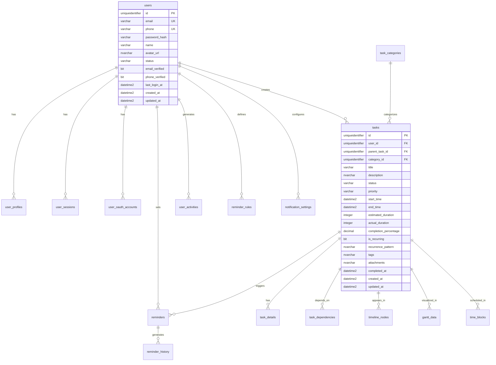

# 🗃️ 智能提醒事项Web App - 实际数据库结构文档

> **重要说明**: 本文档反映了实际创建的数据库结构，与 `01_CreateDatabase_Fixed_v3.sql` 脚本完全一致。

## 🔗 相关文档链接

- [API接口文档](./API文档.md) - 查看数据库表对应的API接口
- [技术架构设计](./技术架构.md#数据库设计) - 查看数据库架构设计原则
- [开发流程实施](./开发流程实施.md#第四步数据库结构设计) - 查看数据库设计流程

## 📋 目录

- [数据库概述](#数据库概述)
- [用户管理表](#用户管理表)
- [任务管理表](#任务管理表)
- [时间线管理表](#时间线管理表)
- [提醒系统表](#提醒系统表)
- [数据分析表](#数据分析表)
- [系统配置表](#系统配置表)
- [索引设计](#索引设计)
- [外键约束](#外键约束)

---

## 🗄️ 数据库概述

### 实际创建状态
- **数据库名称**: ToDoListArea
- **创建时间**: 2025-07-29 20:18:41
- **表数量**: 23个
- **索引数量**: 207个
- **外键约束**: 27个
- **脚本版本**: `01_CreateDatabase_Fixed_v3.sql`

### 技术特性
- **主键类型**: UNIQUEIDENTIFIER (NEWID())
- **时间戳**: DATETIME2 (GETDATE())
- **级联删除**: 用户级联，任务使用NO ACTION避免冲突
- **字符编码**: 支持Unicode (NVARCHAR)

---

## 👥 用户管理表

### 1. users（用户表）
**描述**: 存储用户基本信息和认证数据

| 字段名 | 数据类型 | 约束 | 默认值 | 说明 |
|--------|----------|------|--------|------|
| id | UNIQUEIDENTIFIER | PRIMARY KEY | NEWID() | 用户唯一标识 |
| email | VARCHAR(255) | UNIQUE NOT NULL | - | 邮箱地址 |
| phone | VARCHAR(20) | UNIQUE | NULL | 手机号码 |
| password_hash | VARCHAR(255) | NOT NULL | - | 密码哈希值 |
| name | VARCHAR(100) | NOT NULL | - | 用户姓名 |
| avatar_url | NVARCHAR(MAX) | - | NULL | 头像URL |
| status | VARCHAR(20) | NOT NULL | 'active' | 用户状态 |
| **role** | **VARCHAR(20)** | **NOT NULL** | **'user'** | **用户角色：admin, user** |
| email_verified | BIT | NOT NULL | 0 | 邮箱验证状态 |
| phone_verified | BIT | NOT NULL | 0 | 手机验证状态 |
| last_login_at | DATETIME2 | - | NULL | 最后登录时间 |
| created_at | DATETIME2 | NOT NULL | GETDATE() | 创建时间 |
| updated_at | DATETIME2 | NOT NULL | GETDATE() | 更新时间 |

### 2. invitation_codes（邀请码表）
**描述**: 存储系统邀请码信息，用于控制用户注册权限

| 字段名 | 数据类型 | 约束 | 默认值 | 说明 |
|--------|----------|------|--------|------|
| id | UNIQUEIDENTIFIER | PRIMARY KEY | NEWID() | 邀请码唯一标识 |
| code | VARCHAR(32) | UNIQUE NOT NULL | - | 邀请码字符串 |
| max_uses | INTEGER | NOT NULL | 1 | 最大使用次数 |
| used_count | INTEGER | NOT NULL | 0 | 已使用次数 |
| expires_at | DATETIME2 | - | NULL | 过期时间，NULL表示永不过期 |
| status | VARCHAR(20) | NOT NULL | 'active' | 状态：active, disabled |
| created_by | UNIQUEIDENTIFIER | FOREIGN KEY | - | 创建者用户ID |
| created_at | DATETIME2 | NOT NULL | GETDATE() | 创建时间 |
| updated_at | DATETIME2 | NOT NULL | GETDATE() | 更新时间 |

**索引**:
- `idx_invitation_codes_code` - 邀请码字段索引
- `idx_invitation_codes_status` - 状态字段索引
- `idx_invitation_codes_expires_at` - 过期时间索引
- `idx_invitation_codes_created_by` - 创建者索引

### 3. invitation_code_usages（邀请码使用记录表）
**描述**: 记录邀请码的使用历史，防止重复使用

| 字段名 | 数据类型 | 约束 | 默认值 | 说明 |
|--------|----------|------|--------|------|
| id | UNIQUEIDENTIFIER | PRIMARY KEY | NEWID() | 记录唯一标识 |
| invitation_code_id | UNIQUEIDENTIFIER | FOREIGN KEY | - | 邀请码ID |
| user_id | UNIQUEIDENTIFIER | FOREIGN KEY | - | 使用者用户ID |
| used_at | DATETIME2 | NOT NULL | GETDATE() | 使用时间 |
| ip_address | VARCHAR(45) | - | NULL | 使用者IP地址 |
| user_agent | NVARCHAR(500) | - | NULL | 用户代理信息 |

**约束**:
- `UK_invitation_code_usages_code_user` - 唯一约束：同一用户不能重复使用同一邀请码

**索引**:
- `idx_invitation_code_usages_invitation_code` - 邀请码ID索引
- `idx_invitation_code_usages_user` - 用户ID索引
- `idx_invitation_code_usages_used_at` - 使用时间索引

### 5. user_profiles（用户资料表）
**描述**: 存储用户详细资料和偏好设置

| 字段名 | 数据类型 | 约束 | 默认值 | 说明 |
|--------|----------|------|--------|------|
| id | UNIQUEIDENTIFIER | PRIMARY KEY | NEWID() | 记录唯一标识 |
| user_id | UNIQUEIDENTIFIER | FOREIGN KEY | - | 用户ID |
| first_name | VARCHAR(100) | - | NULL | 名字 |
| last_name | VARCHAR(100) | - | NULL | 姓氏 |
| timezone | VARCHAR(50) | NOT NULL | 'UTC' | 时区设置 |
| language | VARCHAR(10) | NOT NULL | 'zh-CN' | 语言偏好 |
| date_format | VARCHAR(20) | NOT NULL | 'YYYY-MM-DD' | 日期格式 |
| time_format | VARCHAR(10) | NOT NULL | '24h' | 时间格式 |
| notification_preferences | NVARCHAR(MAX) | - | NULL | 通知偏好(JSON) |
| theme_preferences | NVARCHAR(MAX) | - | NULL | 主题偏好(JSON) |
| created_at | DATETIME2 | NOT NULL | GETDATE() | 创建时间 |
| updated_at | DATETIME2 | NOT NULL | GETDATE() | 更新时间 |

### 6. user_sessions（用户会话表）
**描述**: 存储用户登录会话信息

| 字段名 | 数据类型 | 约束 | 默认值 | 说明 |
|--------|----------|------|--------|------|
| id | UNIQUEIDENTIFIER | PRIMARY KEY | NEWID() | 会话唯一标识 |
| user_id | UNIQUEIDENTIFIER | FOREIGN KEY | - | 用户ID |
| session_token | VARCHAR(255) | UNIQUE NOT NULL | - | 会话令牌 |
| refresh_token | VARCHAR(255) | UNIQUE | NULL | 刷新令牌 |
| device_info | NVARCHAR(500) | - | NULL | 设备信息 |
| ip_address | VARCHAR(45) | - | NULL | IP地址 |
| user_agent | NVARCHAR(MAX) | - | NULL | 用户代理 |
| is_active | BIT | NOT NULL | 1 | 是否活跃 |
| expires_at | DATETIME2 | NOT NULL | - | 过期时间 |
| created_at | DATETIME2 | NOT NULL | GETDATE() | 创建时间 |
| updated_at | DATETIME2 | NOT NULL | GETDATE() | 更新时间 |

### 4. user_oauth_accounts（第三方账户表）
**描述**: 存储第三方登录账户信息

| 字段名 | 数据类型 | 约束 | 默认值 | 说明 |
|--------|----------|------|--------|------|
| id | UNIQUEIDENTIFIER | PRIMARY KEY | NEWID() | 记录唯一标识 |
| user_id | UNIQUEIDENTIFIER | FOREIGN KEY | - | 用户ID |
| provider | VARCHAR(50) | NOT NULL | - | 提供商 |
| provider_user_id | VARCHAR(255) | NOT NULL | - | 提供商用户ID |
| provider_email | VARCHAR(255) | - | NULL | 提供商邮箱 |
| provider_data | NVARCHAR(MAX) | - | NULL | 提供商数据(JSON) |
| is_active | BIT | NOT NULL | 1 | 是否活跃 |
| created_at | DATETIME2 | NOT NULL | GETDATE() | 创建时间 |
| updated_at | DATETIME2 | NOT NULL | GETDATE() | 更新时间 |

---

## 📋 任务管理表

### 5. task_categories（任务分类表）
**描述**: 存储任务分类信息（系统级别，非用户级别）

| 字段名 | 数据类型 | 约束 | 默认值 | 说明 |
|--------|----------|------|--------|------|
| id | UNIQUEIDENTIFIER | PRIMARY KEY | NEWID() | 分类唯一标识 |
| name | VARCHAR(100) | NOT NULL | - | 分类名称 |
| color | VARCHAR(7) | NOT NULL | '#007bff' | 分类颜色 |
| icon | VARCHAR(50) | - | NULL | 分类图标 |
| description | NVARCHAR(500) | - | NULL | 分类描述 |
| is_system | BIT | NOT NULL | 0 | 是否系统分类 |
| sort_order | INTEGER | NOT NULL | 0 | 排序顺序 |
| created_at | DATETIME2 | NOT NULL | GETDATE() | 创建时间 |
| updated_at | DATETIME2 | NOT NULL | GETDATE() | 更新时间 |

### 6. tasks（任务表）
**描述**: 存储任务基本信息

| 字段名 | 数据类型 | 约束 | 默认值 | 说明 |
|--------|----------|------|--------|------|
| id | UNIQUEIDENTIFIER | PRIMARY KEY | NEWID() | 任务唯一标识 |
| user_id | UNIQUEIDENTIFIER | FOREIGN KEY | - | 用户ID |
| parent_task_id | UNIQUEIDENTIFIER | FOREIGN KEY | NULL | 父任务ID |
| category_id | UNIQUEIDENTIFIER | FOREIGN KEY | NULL | 分类ID |
| title | VARCHAR(255) | NOT NULL | - | 任务标题 |
| description | NVARCHAR(MAX) | - | NULL | 任务描述 |
| status | VARCHAR(20) | NOT NULL | 'pending' | 任务状态 |
| priority | VARCHAR(10) | NOT NULL | 'medium' | 优先级 |
| start_time | DATETIME2 | - | NULL | 开始时间 |
| end_time | DATETIME2 | - | NULL | 结束时间 |
| estimated_duration | INTEGER | - | NULL | 预估时长(分钟) |
| actual_duration | INTEGER | - | NULL | 实际时长(分钟) |
| completion_percentage | DECIMAL(5,2) | NOT NULL | 0.00 | 完成百分比 |
| is_recurring | BIT | NOT NULL | 0 | 是否重复任务 |
| recurrence_pattern | NVARCHAR(MAX) | - | NULL | 重复模式(JSON) |
| tags | NVARCHAR(MAX) | - | NULL | 标签(JSON) |
| attachments | NVARCHAR(MAX) | - | NULL | 附件(JSON) |
| completed_at | DATETIME2 | - | NULL | 完成时间 |
| created_at | DATETIME2 | NOT NULL | GETDATE() | 创建时间 |
| updated_at | DATETIME2 | NOT NULL | GETDATE() | 更新时间 |

**外键约束**:
- user_id → users(id) ON DELETE CASCADE
- parent_task_id → tasks(id) ON DELETE NO ACTION
- category_id → task_categories(id) ON DELETE SET NULL

### 7. task_details（任务详情表）
**描述**: 存储任务详细信息

| 字段名 | 数据类型 | 约束 | 默认值 | 说明 |
|--------|----------|------|--------|------|
| id | UNIQUEIDENTIFIER | PRIMARY KEY | NEWID() | 记录唯一标识 |
| task_id | UNIQUEIDENTIFIER | FOREIGN KEY | - | 任务ID |
| detail_type | VARCHAR(50) | NOT NULL | - | 详情类型 |
| detail_key | VARCHAR(100) | NOT NULL | - | 详情键 |
| detail_value | NVARCHAR(MAX) | - | NULL | 详情值 |
| sort_order | INTEGER | NOT NULL | 0 | 排序顺序 |
| created_at | DATETIME2 | NOT NULL | GETDATE() | 创建时间 |
| updated_at | DATETIME2 | NOT NULL | GETDATE() | 更新时间 |

### 8. task_dependencies（任务依赖关系表）
**描述**: 存储任务之间的依赖关系

| 字段名 | 数据类型 | 约束 | 默认值 | 说明 |
|--------|----------|------|--------|------|
| id | UNIQUEIDENTIFIER | PRIMARY KEY | NEWID() | 记录唯一标识 |
| task_id | UNIQUEIDENTIFIER | FOREIGN KEY | - | 任务ID |
| depends_on_task_id | UNIQUEIDENTIFIER | FOREIGN KEY | - | 依赖任务ID |
| dependency_type | VARCHAR(20) | NOT NULL | 'finish_to_start' | 依赖类型 |
| lag_time | INTEGER | NOT NULL | 0 | 延迟时间 |
| created_at | DATETIME2 | NOT NULL | GETDATE() | 创建时间 |

**外键约束**:
- task_id → tasks(id) ON DELETE CASCADE
- depends_on_task_id → tasks(id) ON DELETE NO ACTION

### 9. task_templates（任务模板表）
**描述**: 存储任务模板信息

| 字段名 | 数据类型 | 约束 | 默认值 | 说明 |
|--------|----------|------|--------|------|
| id | UNIQUEIDENTIFIER | PRIMARY KEY | NEWID() | 模板唯一标识 |
| user_id | UNIQUEIDENTIFIER | FOREIGN KEY | - | 用户ID |
| name | VARCHAR(255) | NOT NULL | - | 模板名称 |
| description | NVARCHAR(MAX) | - | NULL | 模板描述 |
| template_data | NVARCHAR(MAX) | NOT NULL | - | 模板数据(JSON) |
| category | VARCHAR(100) | - | NULL | 模板分类 |
| is_public | BIT | NOT NULL | 0 | 是否公开 |
| usage_count | INTEGER | NOT NULL | 0 | 使用次数 |
| created_at | DATETIME2 | NOT NULL | GETDATE() | 创建时间 |
| updated_at | DATETIME2 | NOT NULL | GETDATE() | 更新时间 |

---

## 📊 时间线管理表

### 10. timeline_nodes（时间线节点表）
**描述**: 存储时间线节点信息

| 字段名 | 数据类型 | 约束 | 默认值 | 说明 |
|--------|----------|------|--------|------|
| id | UNIQUEIDENTIFIER | PRIMARY KEY | NEWID() | 节点唯一标识 |
| user_id | UNIQUEIDENTIFIER | FOREIGN KEY | - | 用户ID |
| task_id | UNIQUEIDENTIFIER | FOREIGN KEY | NULL | 任务ID |
| node_type | VARCHAR(20) | NOT NULL | 'task' | 节点类型 |
| title | VARCHAR(255) | NOT NULL | - | 节点标题 |
| description | NVARCHAR(MAX) | - | NULL | 节点描述 |
| start_time | DATETIME2 | NOT NULL | - | 开始时间 |
| end_time | DATETIME2 | - | NULL | 结束时间 |
| color | VARCHAR(7) | NOT NULL | '#007bff' | 节点颜色 |
| position_data | NVARCHAR(MAX) | - | NULL | 位置数据(JSON) |
| created_at | DATETIME2 | NOT NULL | GETDATE() | 创建时间 |
| updated_at | DATETIME2 | NOT NULL | GETDATE() | 更新时间 |

**外键约束**:
- user_id → users(id) ON DELETE CASCADE
- task_id → tasks(id) ON DELETE NO ACTION

### 11. timeline_events（时间线事件表）
**描述**: 存储时间线事件和里程碑

| 字段名 | 数据类型 | 约束 | 默认值 | 说明 |
|--------|----------|------|--------|------|
| id | UNIQUEIDENTIFIER | PRIMARY KEY | NEWID() | 事件唯一标识 |
| user_id | UNIQUEIDENTIFIER | FOREIGN KEY | - | 用户ID |
| event_type | VARCHAR(50) | NOT NULL | - | 事件类型 |
| event_title | VARCHAR(255) | NOT NULL | - | 事件标题 |
| event_description | NVARCHAR(MAX) | - | NULL | 事件描述 |
| event_data | NVARCHAR(MAX) | - | NULL | 事件数据(JSON) |
| occurred_at | DATETIME2 | NOT NULL | GETDATE() | 发生时间 |
| created_at | DATETIME2 | NOT NULL | GETDATE() | 创建时间 |

### 12. gantt_data（甘特图数据表）
**描述**: 存储甘特图相关数据

| 字段名 | 数据类型 | 约束 | 默认值 | 说明 |
|--------|----------|------|--------|------|
| id | UNIQUEIDENTIFIER | PRIMARY KEY | NEWID() | 记录唯一标识 |
| user_id | UNIQUEIDENTIFIER | FOREIGN KEY | - | 用户ID |
| task_id | UNIQUEIDENTIFIER | FOREIGN KEY | - | 任务ID |
| start_date | DATETIME2 | NOT NULL | - | 开始日期 |
| end_date | DATETIME2 | NOT NULL | - | 结束日期 |
| progress | DECIMAL(5,2) | NOT NULL | 0.00 | 进度百分比 |
| dependencies | NVARCHAR(MAX) | - | NULL | 依赖关系(JSON) |
| resources | NVARCHAR(MAX) | - | NULL | 资源信息(JSON) |
| created_at | DATETIME2 | NOT NULL | GETDATE() | 创建时间 |
| updated_at | DATETIME2 | NOT NULL | GETDATE() | 更新时间 |

**外键约束**:
- user_id → users(id) ON DELETE CASCADE
- task_id → tasks(id) ON DELETE NO ACTION

### 13. time_blocks（时间块表）
**描述**: 存储专注时间和时间块信息

| 字段名 | 数据类型 | 约束 | 默认值 | 说明 |
|--------|----------|------|--------|------|
| id | UNIQUEIDENTIFIER | PRIMARY KEY | NEWID() | 时间块唯一标识 |
| user_id | UNIQUEIDENTIFIER | FOREIGN KEY | - | 用户ID |
| task_id | UNIQUEIDENTIFIER | FOREIGN KEY | NULL | 关联任务ID |
| title | VARCHAR(255) | NOT NULL | - | 时间块标题 |
| description | NVARCHAR(MAX) | - | NULL | 时间块描述 |
| start_time | DATETIME2 | NOT NULL | - | 开始时间 |
| end_time | DATETIME2 | NOT NULL | - | 结束时间 |
| block_type | VARCHAR(20) | NOT NULL | 'work' | 时间块类型 |
| color | VARCHAR(7) | NOT NULL | '#007bff' | 时间块颜色 |
| is_locked | BIT | NOT NULL | 0 | 是否锁定 |
| created_at | DATETIME2 | NOT NULL | GETDATE() | 创建时间 |
| updated_at | DATETIME2 | NOT NULL | GETDATE() | 更新时间 |

**外键约束**:
- user_id → users(id) ON DELETE CASCADE
- task_id → tasks(id) ON DELETE NO ACTION

---

## 🔔 提醒系统表

### 14. reminders（提醒表）
**描述**: 存储提醒基本信息

| 字段名 | 数据类型 | 约束 | 默认值 | 说明 |
|--------|----------|------|--------|------|
| id | UNIQUEIDENTIFIER | PRIMARY KEY | NEWID() | 提醒唯一标识 |
| user_id | UNIQUEIDENTIFIER | FOREIGN KEY | - | 用户ID |
| task_id | UNIQUEIDENTIFIER | FOREIGN KEY | NULL | 关联任务ID |
| title | VARCHAR(255) | NOT NULL | - | 提醒标题 |
| message | NVARCHAR(MAX) | - | NULL | 提醒消息 |
| reminder_time | DATETIME2 | NOT NULL | - | 提醒时间 |
| status | VARCHAR(20) | NOT NULL | 'pending' | 提醒状态 |
| channels | NVARCHAR(MAX) | NOT NULL | '["web"]' | 提醒渠道(JSON) |
| repeat_pattern | NVARCHAR(MAX) | - | NULL | 重复模式(JSON) |
| snooze_until | DATETIME2 | - | NULL | 延迟到时间 |
| created_at | DATETIME2 | NOT NULL | GETDATE() | 创建时间 |
| updated_at | DATETIME2 | NOT NULL | GETDATE() | 更新时间 |

**外键约束**:
- user_id → users(id) ON DELETE CASCADE
- task_id → tasks(id) ON DELETE NO ACTION

### 15. reminder_rules（提醒规则表）
**描述**: 存储提醒规则和模板

| 字段名 | 数据类型 | 约束 | 默认值 | 说明 |
|--------|----------|------|--------|------|
| id | UNIQUEIDENTIFIER | PRIMARY KEY | NEWID() | 规则唯一标识 |
| user_id | UNIQUEIDENTIFIER | FOREIGN KEY | - | 用户ID |
| rule_name | VARCHAR(255) | NOT NULL | - | 规则名称 |
| rule_type | VARCHAR(50) | NOT NULL | - | 规则类型 |
| conditions | NVARCHAR(MAX) | NOT NULL | - | 触发条件(JSON) |
| actions | NVARCHAR(MAX) | NOT NULL | - | 执行动作(JSON) |
| is_active | BIT | NOT NULL | 1 | 是否激活 |
| priority | INTEGER | NOT NULL | 0 | 优先级 |
| created_at | DATETIME2 | NOT NULL | GETDATE() | 创建时间 |
| updated_at | DATETIME2 | NOT NULL | GETDATE() | 更新时间 |

### 16. reminder_history（提醒历史表）
**描述**: 存储提醒发送历史

| 字段名 | 数据类型 | 约束 | 默认值 | 说明 |
|--------|----------|------|--------|------|
| id | UNIQUEIDENTIFIER | PRIMARY KEY | NEWID() | 记录唯一标识 |
| reminder_id | UNIQUEIDENTIFIER | FOREIGN KEY | - | 提醒ID |
| user_id | UNIQUEIDENTIFIER | FOREIGN KEY | - | 用户ID |
| sent_at | DATETIME2 | NOT NULL | GETDATE() | 发送时间 |
| channel | VARCHAR(50) | NOT NULL | - | 发送渠道 |
| status | VARCHAR(20) | NOT NULL | - | 发送状态 |
| response_data | NVARCHAR(MAX) | - | NULL | 响应数据(JSON) |
| error_message | NVARCHAR(MAX) | - | NULL | 错误信息 |
| created_at | DATETIME2 | NOT NULL | GETDATE() | 创建时间 |

**外键约束**:
- reminder_id → reminders(id) ON DELETE NO ACTION
- user_id → users(id) ON DELETE CASCADE

### 17. notification_settings（通知设置表）
**描述**: 存储用户通知设置

| 字段名 | 数据类型 | 约束 | 默认值 | 说明 |
|--------|----------|------|--------|------|
| id | UNIQUEIDENTIFIER | PRIMARY KEY | NEWID() | 设置唯一标识 |
| user_id | UNIQUEIDENTIFIER | FOREIGN KEY | - | 用户ID |
| channel | VARCHAR(50) | NOT NULL | - | 通知渠道 |
| is_enabled | BIT | NOT NULL | 1 | 是否启用 |
| settings | NVARCHAR(MAX) | - | NULL | 渠道设置(JSON) |
| quiet_hours_start | TIME | - | NULL | 静音开始时间 |
| quiet_hours_end | TIME | - | NULL | 静音结束时间 |
| timezone | VARCHAR(50) | NOT NULL | 'UTC' | 时区 |
| created_at | DATETIME2 | NOT NULL | GETDATE() | 创建时间 |
| updated_at | DATETIME2 | NOT NULL | GETDATE() | 更新时间 |

**唯一约束**: (user_id, channel)

---

## 📊 数据分析表

### 18. user_activities（用户活动表）
**描述**: 存储用户活动记录

| 字段名 | 数据类型 | 约束 | 默认值 | 说明 |
|--------|----------|------|--------|------|
| id | UNIQUEIDENTIFIER | PRIMARY KEY | NEWID() | 记录唯一标识 |
| user_id | UNIQUEIDENTIFIER | FOREIGN KEY | - | 用户ID |
| activity_type | VARCHAR(50) | NOT NULL | - | 活动类型 |
| activity_description | NVARCHAR(500) | - | NULL | 活动描述 |
| entity_type | VARCHAR(50) | - | NULL | 实体类型 |
| entity_id | UNIQUEIDENTIFIER | - | NULL | 实体ID |
| metadata | NVARCHAR(MAX) | - | NULL | 元数据(JSON) |
| ip_address | VARCHAR(45) | - | NULL | IP地址 |
| user_agent | NVARCHAR(MAX) | - | NULL | 用户代理 |
| created_at | DATETIME2 | NOT NULL | GETDATE() | 创建时间 |

### 19. task_statistics（任务统计表）
**描述**: 存储任务统计数据

| 字段名 | 数据类型 | 约束 | 默认值 | 说明 |
|--------|----------|------|--------|------|
| id | UNIQUEIDENTIFIER | PRIMARY KEY | NEWID() | 记录唯一标识 |
| user_id | UNIQUEIDENTIFIER | FOREIGN KEY | - | 用户ID |
| date | DATE | NOT NULL | - | 统计日期 |
| total_tasks | INTEGER | NOT NULL | 0 | 总任务数 |
| completed_tasks | INTEGER | NOT NULL | 0 | 完成任务数 |
| pending_tasks | INTEGER | NOT NULL | 0 | 待处理任务数 |
| overdue_tasks | INTEGER | NOT NULL | 0 | 过期任务数 |
| total_time_spent | INTEGER | NOT NULL | 0 | 总花费时间(分钟) |
| productivity_score | DECIMAL(5,2) | - | NULL | 生产力评分 |
| created_at | DATETIME2 | NOT NULL | GETDATE() | 创建时间 |
| updated_at | DATETIME2 | NOT NULL | GETDATE() | 更新时间 |

**唯一约束**: (user_id, date)

### 20. productivity_metrics（生产力指标表）
**描述**: 存储生产力相关指标

| 字段名 | 数据类型 | 约束 | 默认值 | 说明 |
|--------|----------|------|--------|------|
| id | UNIQUEIDENTIFIER | PRIMARY KEY | NEWID() | 记录唯一标识 |
| user_id | UNIQUEIDENTIFIER | FOREIGN KEY | - | 用户ID |
| metric_type | VARCHAR(50) | NOT NULL | - | 指标类型 |
| metric_value | DECIMAL(10,2) | NOT NULL | - | 指标值 |
| metric_unit | VARCHAR(20) | - | NULL | 单位 |
| period_start | DATETIME2 | NOT NULL | - | 周期开始 |
| period_end | DATETIME2 | NOT NULL | - | 周期结束 |
| metadata | NVARCHAR(MAX) | - | NULL | 元数据(JSON) |
| created_at | DATETIME2 | NOT NULL | GETDATE() | 创建时间 |

---

## ⚙️ 系统配置表

### 21. system_configs（系统配置表）
**描述**: 存储系统配置信息

| 字段名 | 数据类型 | 约束 | 默认值 | 说明 |
|--------|----------|------|--------|------|
| id | UNIQUEIDENTIFIER | PRIMARY KEY | NEWID() | 配置唯一标识 |
| config_key | VARCHAR(100) | UNIQUE NOT NULL | - | 配置键 |
| config_value | NVARCHAR(MAX) | NOT NULL | - | 配置值 |
| description | NVARCHAR(500) | - | NULL | 配置描述 |
| is_encrypted | BIT | NOT NULL | 0 | 是否加密 |
| created_at | DATETIME2 | NOT NULL | GETDATE() | 创建时间 |
| updated_at | DATETIME2 | NOT NULL | GETDATE() | 更新时间 |

### 22. feature_flags（功能开关表）
**描述**: 存储功能开关配置

| 字段名 | 数据类型 | 约束 | 默认值 | 说明 |
|--------|----------|------|--------|------|
| id | UNIQUEIDENTIFIER | PRIMARY KEY | NEWID() | 开关唯一标识 |
| flag_key | VARCHAR(100) | UNIQUE NOT NULL | - | 功能键 |
| is_enabled | BIT | NOT NULL | 0 | 是否启用 |
| description | NVARCHAR(500) | - | NULL | 功能描述 |
| target_users | NVARCHAR(MAX) | - | NULL | 目标用户(JSON) |
| start_date | DATETIME2 | - | NULL | 开始日期 |
| end_date | DATETIME2 | - | NULL | 结束日期 |
| created_at | DATETIME2 | NOT NULL | GETDATE() | 创建时间 |
| updated_at | DATETIME2 | NOT NULL | GETDATE() | 更新时间 |

### 23. system_logs（系统日志表）
**描述**: 存储系统操作日志

| 字段名 | 数据类型 | 约束 | 默认值 | 说明 |
|--------|----------|------|--------|------|
| id | UNIQUEIDENTIFIER | PRIMARY KEY | NEWID() | 日志唯一标识 |
| log_level | VARCHAR(20) | NOT NULL | - | 日志级别 |
| logger_name | VARCHAR(255) | NOT NULL | - | 记录器名称 |
| message | NVARCHAR(MAX) | NOT NULL | - | 日志消息 |
| exception | NVARCHAR(MAX) | - | NULL | 异常信息 |
| properties | NVARCHAR(MAX) | - | NULL | 属性(JSON) |
| user_id | UNIQUEIDENTIFIER | FOREIGN KEY | NULL | 用户ID |
| request_id | VARCHAR(100) | - | NULL | 请求ID |
| created_at | DATETIME2 | NOT NULL | GETDATE() | 创建时间 |

**外键约束**:
- user_id → users(id) ON DELETE SET NULL

---

## 🔍 索引设计

### 主要索引
- **用户表**: email, status, created_at
- **任务表**: user_id, status, priority, start_time, end_time, parent_task_id, category_id
- **提醒表**: user_id, task_id, reminder_time, status
- **用户活动**: user_id, activity_type, created_at
- **会话表**: user_id, session_token, expires_at

### 复合索引
- `idx_tasks_user_status_priority` (user_id, status, priority)
- `idx_user_activities_user_type_time` (user_id, activity_type, created_at)

---

## 🔗 外键约束总结

### 级联删除策略
- **用户删除**: 级联删除所有用户相关数据
- **任务删除**: 相关表使用 NO ACTION 或 SET NULL，避免循环级联

### 27个外键约束
1. user_profiles.user_id → users.id (CASCADE)
2. user_sessions.user_id → users.id (CASCADE)
3. user_oauth_accounts.user_id → users.id (CASCADE)
4. tasks.user_id → users.id (CASCADE)
5. tasks.parent_task_id → tasks.id (NO ACTION)
6. tasks.category_id → task_categories.id (SET NULL)
7. task_details.task_id → tasks.id (CASCADE)
8. task_dependencies.task_id → tasks.id (CASCADE)
9. task_dependencies.depends_on_task_id → tasks.id (NO ACTION)
10. task_templates.user_id → users.id (CASCADE)
11. timeline_nodes.user_id → users.id (CASCADE)
12. timeline_nodes.task_id → tasks.id (NO ACTION)
13. timeline_events.user_id → users.id (CASCADE)
14. gantt_data.user_id → users.id (CASCADE)
15. gantt_data.task_id → tasks.id (NO ACTION)
16. time_blocks.user_id → users.id (CASCADE)
17. time_blocks.task_id → tasks.id (NO ACTION)
18. reminders.user_id → users.id (CASCADE)
19. reminders.task_id → tasks.id (NO ACTION)
20. reminder_rules.user_id → users.id (CASCADE)
21. reminder_history.reminder_id → reminders.id (NO ACTION)
22. reminder_history.user_id → users.id (CASCADE)
23. notification_settings.user_id → users.id (CASCADE)
24. user_activities.user_id → users.id (CASCADE)
25. task_statistics.user_id → users.id (CASCADE)
26. productivity_metrics.user_id → users.id (CASCADE)
27. system_logs.user_id → users.id (SET NULL)

---

## 📝 总结

本文档准确反映了实际创建的数据库结构，包括：

✅ **23个表完整创建**
✅ **27个外键约束正确配置**
✅ **207个索引优化查询性能**
✅ **级联删除冲突已解决**
✅ **默认数据已插入**

数据库已完全就绪，可以开始ASP.NET Core后端开发！

## 🗄️ 数据库ER图

---

## 📝 更新记录

| 版本 | 日期 | 更新人 | 变更说明 |
|------|------|--------|----------|
| v1.0 | 2025-07-29 | AreaSong | 初始版本创建，实际数据库结构文档 |

### 更新频率说明
- **Schema变更**: 数据库结构变更时立即更新
- **索引优化**: 性能优化导致的索引变更时更新
- **约束调整**: 外键约束或检查约束变更时更新

### 数据库同步机制
- **代码优先**: 使用Entity Framework Core Code First方式
- **迁移脚本**: 自动生成数据库迁移脚本
- **版本控制**: 数据库Schema变更纳入版本控制

### 与API接口的映射关系
本数据库结构与API接口的对应关系，详见 [API文档.md](./API文档.md)：

- **用户管理表** ↔ [认证授权API](./API文档.md#认证授权api)
- **任务管理表** ↔ [任务管理API](./API文档.md#任务管理api)
- **时间线管理表** ↔ [时间线管理API](./API文档.md#时间线管理api)
- **提醒系统表** ↔ [提醒系统API](./API文档.md#提醒系统api)
- **数据分析表** ↔ [数据分析API](./API文档.md#数据分析api)
