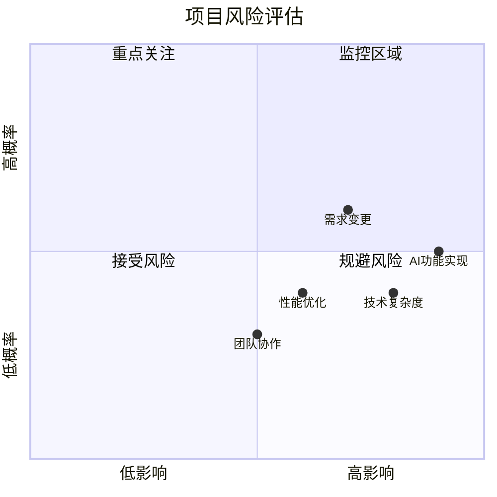

# 📊 ToDoListArea项目实施方案综合分析报告

## 🔗 相关文档链接

- [功能需求梳理](./功能梳理.md) - 查看详细功能分析
- [技术架构设计](./技术架构.md) - 查看技术实现方案
- [API接口文档](./API文档.md) - 查看接口设计规范
- [数据库设计](./数据库表_实际结构.md) - 查看数据存储设计
- [开发流程实施](./开发流程实施.md) - 查看实施流程规范
- [当前开发进度](./当前开发进度.md) - 查看项目执行状态

## 🎯 项目概览与定位

### 项目核心定位
ToDoListArea是一个面向技术人员的智能提醒事项管理系统，其核心创新在于集成交互式甘特图可视化、AI智能任务规划和冲突解决能力，以及多维度提醒功能。项目定位明确，旨在解决现有任务管理应用功能单一、缺乏可视化时间规划工具和智能调整能力的痛点。

### 目标用户群体
项目明确定位于计算机学生、程序员、IT从业者等技术人员群体，这一定位体现了对目标市场的深度理解。用户画像清晰，包括年龄范围（14岁以上）、技术水平（熟悉计算机操作）、特殊需求（支持Markdown等技术格式）等维度，为产品设计提供了明确的方向指引。

## 🏗️ 技术架构设计分析

### 技术选型的合理性
项目采用ASP.NET Core 8.0 + React 18 + SQL Server 2022 + Azure的企业级技术栈，这一选择体现了以下优势：

**前端技术栈**：React 18配合TypeScript提供了强类型安全保障，TailwindCSS和HeadlessUI的组合既保证了开发效率又确保了UI的一致性。Vite作为构建工具，相比传统的Webpack具有更快的开发体验。

**后端技术栈**：ASP.NET Core 8.0作为成熟的企业级框架，提供了完整的生态支持。Entity Framework Core 8.0作为ORM工具，简化了数据访问层的开发复杂度。JWT认证配合ASP.NET Core Identity，构建了完整的身份认证体系。

**基础设施选择**：全面拥抱Azure云服务生态，从Azure App Service到Azure SQL Database，再到Application Insights监控，形成了完整的云原生解决方案。

### 架构演进策略
项目制定了清晰的四阶段技术演进路径：

**MVP阶段**（0-3个月）：采用单体应用架构，快速验证产品价值，支持100-1000用户规模。

**初期阶段**（3-12个月）：引入Redis缓存、Hangfire后台任务、AI集成等增强功能，支持1000-10万用户规模。

**中期阶段**（1-3年）：转向微服务架构，引入Service Fabric服务治理、Azure API Management等企业级组件，支持10万-100万用户规模。

**长期阶段**（3-5年）：构建全球化分布式架构，支持100万-3亿用户规模的企业级平台。

这种渐进式的架构演进策略既保证了初期的快速迭代能力，又为长期的规模化发展预留了技术空间。

## 📊 数据库设计评估

### 数据模型设计
数据库设计采用了23个表的完整结构，覆盖了用户管理、任务管理、时间线管理、提醒系统、数据分析、系统配置等六大功能模块。设计遵循第三范式，有效减少了数据冗余。

**用户管理模块**：包含users、user_profiles、user_sessions、user_oauth_accounts等表，支持完整的用户生命周期管理。

**任务管理模块**：核心的tasks表配合task_details、task_categories、task_dependencies、task_templates等辅助表，构建了灵活的任务管理体系。

**时间线管理模块**：timeline_nodes、gantt_data、time_blocks等表支持了甘特图可视化的核心功能。

**提醒系统模块**：reminders、reminder_rules、reminder_history等表实现了灵活的提醒规则配置和历史追踪。

### 性能优化考虑
数据库设计充分考虑了性能优化需求，为关键字段创建了合适的索引，如用户邮箱的唯一索引、任务状态的复合索引等。同时预留了全文搜索索引的设计，为后期的搜索功能优化奠定了基础。

## 🔌 API接口设计规范

### RESTful设计原则
API设计严格遵循RESTful规范，采用标准的HTTP动词和状态码，URL设计清晰合理。统一的响应格式设计提高了前后端交互的一致性。

**认证授权API**：涵盖了用户注册、登录、密码管理、第三方登录等完整的身份认证流程。

**任务管理API**：提供了任务的CRUD操作、批量操作、搜索筛选等功能，支持复杂的业务场景。

**时间线管理API**：专门为甘特图功能设计的API接口，支持时间调整、冲突检测、AI智能调整等高级功能。

### 错误处理机制
API设计建立了完整的错误分类体系，包括认证错误、任务错误、提醒错误、系统错误等四大类别，每类错误都有明确的错误码和描述，便于前端进行针对性的错误处理。

## 🔄 开发流程实施评估

### 流程设计的科学性
开发流程采用了经典的瀑布式开发模型，将整个开发过程分解为十个明确的步骤：需求梳理、原型设计、UI设计、数据库设计、API设计、后端开发、前端开发、联调测试、功能测试、部署上线。

每个步骤都有明确的时间预估和交付物要求，为项目管理提供了清晰的里程碑。特别是后端开发部分，详细描述了企业级ASP.NET Core架构的实施要点，包括三层架构搭建、Entity Framework Core配置、JWT认证实现等关键技术环节。

### 质量保证措施
流程设计中融入了完整的质量保证体系，包括代码审查、单元测试、集成测试、性能测试等多个维度。特别是在安全性方面，从JWT配置到数据传输加密，从输入验证到SQL注入防护，构建了多层次的安全防护体系。

## 📈 项目进度管理分析

### 进度规划的合理性
项目将整个开发过程分为六个阶段，总计85个具体任务点。当前已完成需求分析与设计阶段的25个任务，正在进行开发环境搭建阶段的3个任务，剩余57个任务待开始。

进度规划体现了良好的项目管理实践，每个阶段都有明确的完成标准和验收条件。特别是将复杂的开发任务细分为具体的可执行任务点，提高了项目执行的可控性。

### 风险识别与控制
项目进度文档中体现了对技术风险的充分考虑，包括新技术学习成本、第三方依赖稳定性、性能瓶颈预防等方面。同时建立了里程碑评审机制和应急预案，为项目的顺利推进提供了保障。

## 🔍 文档关联性与一致性分析

### 文档间的协调性
各实施方案文档之间展现了良好的协调性和一致性：

**技术选型一致性**：所有文档都统一采用ASP.NET Core + React + SQL Server的技术栈，没有出现技术选型的冲突。

**功能设计一致性**：功能梳理文档中的功能模块与数据库设计、API设计完全对应，形成了完整的功能闭环。

**进度规划一致性**：开发流程实施文档的十步流程与项目进度文档的六阶段规划相互呼应，时间估算基本合理。

### 设计深度的均衡性
各文档的设计深度相对均衡，既有宏观的架构设计，也有微观的实现细节。特别是在关键技术环节，如JWT认证、Entity Framework配置、API设计等方面，提供了足够的技术细节支撑实际开发。

## ⚠️ 潜在风险与实施难点

### 技术实施风险
**架构复杂度风险**：项目采用的企业级架构相对复杂，对开发团队的技术能力要求较高，特别是在微服务架构转型阶段，可能面临较大的技术挑战。

**AI功能实现风险**：项目规划中的AI智能任务调整功能是核心创新点，但AI算法的实现复杂度较高，可能成为项目推进的瓶颈。

**性能优化风险**：甘特图可视化和实时数据同步功能对前端性能要求较高，需要在用户体验和系统性能之间找到平衡点。

### 项目管理风险
**需求变更风险**：作为创新型产品，在实际开发过程中可能面临需求调整的压力，需要建立灵活的需求管理机制。

**团队协作风险**：项目涉及前端、后端、数据库、UI设计等多个专业领域，需要建立有效的团队协作机制。

## 💡 改进建议与优化方向

### 技术架构优化
**微服务拆分策略细化**：建议在中期阶段的微服务架构设计中，进一步细化服务拆分的边界和通信机制，避免过度拆分导致的复杂性增加。

**缓存策略完善**：建议在初期阶段就引入Redis缓存，特别是对用户会话、任务列表等高频访问数据进行缓存优化。

**监控体系增强**：建议从MVP阶段就建立完整的监控体系，包括应用性能监控、业务指标监控、用户行为分析等。

### 开发流程优化
**敏捷开发元素融入**：建议在现有瀑布式流程基础上，融入敏捷开发的迭代思想，特别是在功能开发阶段采用短周期迭代。

**自动化测试增强**：建议建立更完善的自动化测试体系，包括单元测试、集成测试、端到端测试的自动化执行。

**持续集成优化**：建议从项目初期就建立CI/CD流水线，实现代码提交到部署的全自动化流程。

### 产品功能优化
**用户体验设计**：建议在UI设计阶段增加用户体验测试环节，通过原型测试验证交互设计的合理性。

**移动端适配**：建议在前端开发阶段重点考虑移动端的用户体验，特别是甘特图在小屏幕设备上的交互优化。

**国际化支持**：建议在架构设计阶段就考虑国际化支持，为后期的全球化发展奠定基础。

## 📋 综合评估结论

### 整体评价
ToDoListArea项目的实施方案展现了较高的专业水准和完整性。从技术选型到架构设计，从功能规划到实施流程，都体现了企业级项目的标准和要求。特别是在技术架构的演进策略设计上，体现了对产品生命周期的深度思考。

### 成功要素
**清晰的产品定位**：面向技术人员的差异化定位为产品成功奠定了基础。

**合理的技术选型**：企业级技术栈的选择保证了系统的稳定性和可扩展性。

**完整的设计体系**：从数据库到API，从前端到后端，形成了完整的技术设计闭环。

**科学的实施流程**：十步开发流程和六阶段进度规划为项目执行提供了清晰的路径。

### 关键成功因素
项目成功的关键在于严格按照既定的技术架构和开发流程执行，同时保持对用户需求变化的敏感性和技术创新的持续投入。特别是AI智能功能的实现质量，将直接影响产品的市场竞争力。

总体而言，ToDoListArea项目的实施方案具备了成功的基础条件，在严格执行的前提下，有望成为技术人员任务管理领域的优秀产品。

---

**报告生成时间**：2025年7月29日
**分析范围**：实施方案目录下所有文档
**报告版本**：v1.0

## 📊 项目风险评估矩阵

---

## 📝 更新记录

| 版本 | 日期 | 更新人 | 变更说明 |
|------|------|--------|----------|
| v1.0 | 2025-07-29 | AreaSong | 初始版本创建，项目综合分析报告 |

### 更新频率说明
- **阶段评审**: 每个开发阶段结束后更新分析结论
- **风险评估**: 发现新风险或风险状态变化时更新
- **改进建议**: 根据实际开发经验更新改进建议

### 分析方法说明
本报告采用以下分析方法：
- **文档一致性分析**: 检查各文档间的技术选型和设计一致性
- **可行性评估**: 评估技术方案的实施可行性
- **风险识别**: 识别项目实施过程中的潜在风险
- **改进建议**: 基于最佳实践提出优化建议

### 后续分析计划
- **开发阶段分析**: 开发过程中的技术实施效果分析
- **性能评估**: 系统性能测试结果分析
- **用户反馈分析**: 用户使用反馈的综合分析
- **商业价值评估**: 产品商业价值实现情况分析
