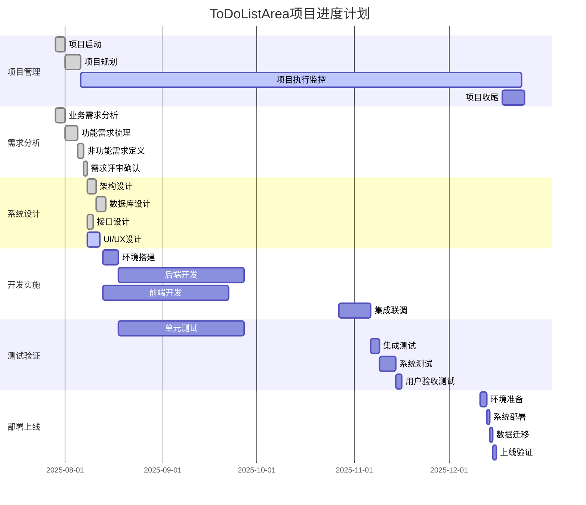
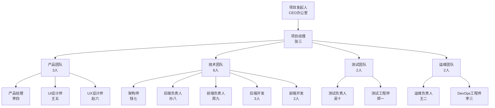

# 📊 ToDoListArea项目管理计划

## 🔗 相关文档链接

- [文档体系主索引](./00_文档体系主索引.md) - 查看完整文档体系
- [项目章程与需求规格书](./01_项目章程与需求规格书.md) - 查看项目需求
- [技术选型与架构设计](./03_技术选型与架构设计.md) - 查看技术方案
- [开发实施指南](./06_开发实施指南.md) - 查看实施步骤

## 📋 目录

- [项目概述](#项目概述)
- [工作分解结构](#工作分解结构)
- [进度计划](#进度计划)
- [资源管理](#资源管理)
- [风险管理](#风险管理)
- [质量管理](#质量管理)
- [沟通管理](#沟通管理)

---

## 🎯 项目概述

### 📊 项目基本信息

| 项目属性 | 详细信息 |
|----------|----------|
| **项目名称** | ToDoListArea - 智能提醒事项管理系统 |
| **项目代码** | TLA-2025 |
| **项目经理** | 张三 (pm@todolistarea.com) |
| **项目发起人** | CEO办公室 |
| **项目类型** | 企业级Web应用开发 |
| **项目优先级** | 高 |
| **预算总额** | ¥1,000,000 |
| **计划工期** | 6个月 (2025-07-29 至 2025-12-24) |

### 🎯 项目目标

#### 业务目标
1. **市场目标**: 在6个月内发布MVP版本，获得1000+注册用户
2. **收入目标**: 12个月内实现月收入¥50,000
3. **用户目标**: 用户满意度达到4.5分以上
4. **技术目标**: 建立可扩展的企业级技术架构

#### 成功标准
- [ ] MVP版本按时发布，功能完整度≥95%
- [ ] 系统性能指标达到设计要求
- [ ] 用户注册转化率≥60%
- [ ] 系统可用性≥99.9%
- [ ] 代码质量通过所有质量门禁

### 📈 项目里程碑

| 里程碑 | 计划日期 | 关键交付物 | 验收标准 |
|--------|----------|------------|----------|
| **M1: 需求确认** | 2025-08-12 | 需求规格书、原型设计 | 需求评审通过 |
| **M2: 设计完成** | 2025-08-26 | 架构设计、详细设计 | 设计评审通过 |
| **M3: 开发完成** | 2025-11-26 | 完整系统、单元测试 | 功能测试通过 |
| **M4: 测试完成** | 2025-12-10 | 测试报告、性能报告 | 验收测试通过 |
| **M5: 上线发布** | 2025-12-24 | 生产系统、用户手册 | 生产验收通过 |

---

## 🔧 工作分解结构 (WBS)

### 📊 WBS层级结构

```
1. ToDoListArea项目
├── 1.1 项目管理
│   ├── 1.1.1 项目启动
│   ├── 1.1.2 项目规划
│   ├── 1.1.3 项目执行监控
│   └── 1.1.4 项目收尾
├── 1.2 需求分析
│   ├── 1.2.1 业务需求分析
│   ├── 1.2.2 功能需求梳理
│   ├── 1.2.3 非功能需求定义
│   └── 1.2.4 需求评审确认
├── 1.3 系统设计
│   ├── 1.3.1 架构设计
│   ├── 1.3.2 数据库设计
│   ├── 1.3.3 接口设计
│   └── 1.3.4 UI/UX设计
├── 1.4 开发实施
│   ├── 1.4.1 环境搭建
│   ├── 1.4.2 后端开发
│   ├── 1.4.3 前端开发
│   └── 1.4.4 集成联调
├── 1.5 测试验证
│   ├── 1.5.1 单元测试
│   ├── 1.5.2 集成测试
│   ├── 1.5.3 系统测试
│   └── 1.5.4 用户验收测试
└── 1.6 部署上线
    ├── 1.6.1 环境准备
    ├── 1.6.2 系统部署
    ├── 1.6.3 数据迁移
    └── 1.6.4 上线验证
```

### 📋 详细任务分解

#### 1.2 需求分析阶段 (2周)
| 任务ID | 任务名称 | 工期 | 前置任务 | 负责人 | 交付物 |
|--------|----------|------|----------|--------|--------|
| 1.2.1 | 业务需求分析 | 3天 | 1.1.2 | 产品经理 | 业务需求文档 |
| 1.2.2 | 功能需求梳理 | 4天 | 1.2.1 | 产品经理 | 功能规格说明 |
| 1.2.3 | 非功能需求定义 | 2天 | 1.2.2 | 架构师 | 非功能需求文档 |
| 1.2.4 | 需求评审确认 | 1天 | 1.2.3 | 项目经理 | 需求评审报告 |

#### 1.3 系统设计阶段 (2周)
| 任务ID | 任务名称 | 工期 | 前置任务 | 负责人 | 交付物 |
|--------|----------|------|----------|--------|--------|
| 1.3.1 | 架构设计 | 3天 | 1.2.4 | 架构师 | 架构设计文档 |
| 1.3.2 | 数据库设计 | 3天 | 1.3.1 | 数据库工程师 | 数据库设计文档 |
| 1.3.3 | 接口设计 | 2天 | 1.3.1 | 后端负责人 | API接口文档 |
| 1.3.4 | UI/UX设计 | 4天 | 1.2.4 | UI设计师 | UI设计稿 |

#### 1.4 开发实施阶段 (13周)
| 任务ID | 任务名称 | 工期 | 前置任务 | 负责人 | 交付物 |
|--------|----------|------|----------|--------|--------|
| 1.4.1 | 环境搭建 | 1周 | 1.3.2 | DevOps工程师 | 开发环境 |
| 1.4.2 | 后端开发 | 8周 | 1.4.1 | 后端团队 | 后端系统 |
| 1.4.3 | 前端开发 | 8周 | 1.3.4 | 前端团队 | 前端应用 |
| 1.4.4 | 集成联调 | 2周 | 1.4.2,1.4.3 | 全体开发 | 集成系统 |

#### 1.5 测试验证阶段 (2周)
| 任务ID | 任务名称 | 工期 | 前置任务 | 负责人 | 交付物 |
|--------|----------|------|----------|--------|--------|
| 1.5.1 | 单元测试 | 并行 | 1.4.2,1.4.3 | 开发团队 | 单元测试报告 |
| 1.5.2 | 集成测试 | 3天 | 1.4.4 | 测试团队 | 集成测试报告 |
| 1.5.3 | 系统测试 | 5天 | 1.5.2 | 测试团队 | 系统测试报告 |
| 1.5.4 | 用户验收测试 | 2天 | 1.5.3 | 产品团队 | 验收测试报告 |

#### 1.6 部署上线阶段 (2周)
| 任务ID | 任务名称 | 工期 | 前置任务 | 负责人 | 交付物 |
|--------|----------|------|----------|--------|--------|
| 1.6.1 | 环境准备 | 2天 | 1.5.4 | 运维团队 | 生产环境 |
| 1.6.2 | 系统部署 | 1天 | 1.6.1 | 运维团队 | 部署系统 |
| 1.6.3 | 数据迁移 | 1天 | 1.6.2 | 数据团队 | 生产数据 |
| 1.6.4 | 上线验证 | 1天 | 1.6.3 | 全体团队 | 上线报告 |

---

## 📅 进度计划

### 🗓️ 项目甘特图



### 📊 关键路径分析

#### 关键路径识别
**关键路径**: 项目启动 → 需求分析 → 架构设计 → 后端开发 → 集成联调 → 系统测试 → 部署上线

**关键路径工期**: 21周 (147天)
**项目总工期**: 21周 (147天)
**浮动时间**: 0天

#### 关键任务管理
| 关键任务 | 风险等级 | 缓解措施 |
|----------|----------|----------|
| **后端开发** | 高 | 增加资源投入，并行开发 |
| **集成联调** | 中 | 提前进行接口对接测试 |
| **系统测试** | 中 | 自动化测试，提高效率 |

### ⏰ 进度监控机制

#### 进度报告制度
- **日报**: 每日站会，汇报进度和问题
- **周报**: 每周五发送项目进度周报
- **月报**: 每月底发送项目进度月报
- **里程碑报告**: 每个里程碑完成后发送专项报告

#### 进度偏差处理
1. **绿色状态** (进度正常): 按计划执行
2. **黄色状态** (轻微延期): 调整资源分配
3. **红色状态** (严重延期): 启动应急预案

---

## 👥 资源管理

### 🏢 组织架构



### 👨‍💻 人力资源配置

#### 核心团队成员
| 角色 | 姓名 | 技能等级 | 投入比例 | 主要职责 |
|------|------|----------|----------|----------|
| **项目经理** | 张三 | 高级 | 100% | 项目整体管理和协调 |
| **产品经理** | 李四 | 高级 | 100% | 需求管理和产品设计 |
| **架构师** | 钱七 | 专家 | 80% | 技术架构设计和决策 |
| **后端负责人** | 孙八 | 高级 | 100% | 后端开发管理 |
| **前端负责人** | 周九 | 高级 | 100% | 前端开发管理 |
| **测试负责人** | 吴十 | 中级 | 100% | 测试管理和质量保证 |
| **运维负责人** | 王二 | 中级 | 60% | 部署和运维管理 |

#### 资源需求计划
| 阶段 | 产品 | 开发 | 测试 | 运维 | 总人天 |
|------|------|------|------|------|--------|
| **需求分析** | 3人×10天 | 1人×5天 | 0 | 0 | 35天 |
| **系统设计** | 2人×10天 | 3人×10天 | 0 | 1人×5天 | 55天 |
| **开发实施** | 1人×65天 | 8人×65天 | 1人×20天 | 2人×10天 | 625天 |
| **测试验证** | 2人×10天 | 2人×10天 | 2人×10天 | 1人×5天 | 65天 |
| **部署上线** | 1人×5天 | 2人×10天 | 1人×5天 | 2人×10天 | 50天 |

### 💰 预算管理

#### 预算分解
| 类别 | 预算金额 | 占比 | 说明 |
|------|----------|------|------|
| **人力成本** | ¥800,000 | 80% | 团队薪资和福利 |
| **技术成本** | ¥120,000 | 12% | 云服务、软件许可 |
| **运营成本** | ¥50,000 | 5% | 市场推广、培训 |
| **管理费用** | ¥30,000 | 3% | 项目管理、差旅 |
| **总预算** | ¥1,000,000 | 100% | 包含风险缓冲 |

#### 成本控制措施
1. **预算审批**: 超过¥5,000的支出需要项目经理审批
2. **成本监控**: 每周监控实际支出与预算的偏差
3. **变更控制**: 影响预算的变更需要发起人审批
4. **采购管理**: 统一采购，获得批量折扣

---

## ⚠️ 风险管理

### 🎯 风险识别与评估

#### 高风险项目
| 风险ID | 风险描述 | 概率 | 影响 | 风险等级 | 负责人 |
|--------|----------|------|------|----------|--------|
| R001 | AI算法实现复杂度超预期 | 60% | 高 | 高 | 架构师 |
| R002 | 关键人员离职 | 30% | 高 | 中 | 项目经理 |
| R003 | 第三方服务不稳定 | 40% | 中 | 中 | 技术负责人 |
| R004 | 需求变更频繁 | 50% | 中 | 中 | 产品经理 |

#### 中风险项目
| 风险ID | 风险描述 | 概率 | 影响 | 风险等级 | 负责人 |
|--------|----------|------|------|----------|--------|
| R005 | 性能不达标 | 30% | 中 | 中 | 架构师 |
| R006 | 集成测试问题 | 40% | 中 | 中 | 测试负责人 |
| R007 | 部署环境问题 | 25% | 中 | 低 | 运维负责人 |

### 🛡️ 风险应对策略

#### R001: AI算法实现复杂度
**应对策略**: 规避 + 缓解
- **规避措施**: 使用成熟的AI服务(Azure OpenAI)
- **缓解措施**: 分阶段实现，先简单后复杂
- **应急计划**: 提供手动调整功能作为备选
- **监控指标**: 算法开发进度，技术难点解决情况

#### R002: 关键人员离职
**应对策略**: 缓解 + 转移
- **缓解措施**: 知识文档化，交叉培训
- **转移措施**: 外包关键技能，建立人才储备
- **应急计划**: 快速招聘，内部调配
- **监控指标**: 员工满意度，离职倾向调查

#### R003: 第三方服务不稳定
**应对策略**: 缓解 + 接受
- **缓解措施**: 选择可靠供应商，建立备选方案
- **接受措施**: 制定服务中断应对流程
- **应急计划**: 快速切换到备选服务
- **监控指标**: 服务可用性，响应时间

### 📊 风险监控机制

#### 风险监控频率
- **高风险**: 每日监控
- **中风险**: 每周监控
- **低风险**: 每月监控

#### 风险报告制度
- **风险日报**: 高风险项目每日报告
- **风险周报**: 所有风险项目每周汇总
- **风险评审**: 每月进行风险评审会议

---

## ✅ 质量管理

### 🎯 质量目标

| 质量维度 | 目标值 | 测量方法 |
|----------|--------|----------|
| **功能完整性** | ≥95% | 需求覆盖率测试 |
| **代码质量** | ≥80% | 代码覆盖率、静态分析 |
| **性能指标** | API<300ms | 性能测试 |
| **可用性** | ≥99.9% | 系统监控 |
| **用户满意度** | ≥4.5分 | 用户反馈调查 |

### 🔍 质量保证活动

#### 设计阶段质量活动
- **需求评审**: 需求完整性、一致性检查
- **设计评审**: 架构合理性、技术可行性评估
- **原型验证**: 用户体验、交互逻辑验证

#### 开发阶段质量活动
- **代码评审**: 每个PR必须经过代码评审
- **单元测试**: 代码覆盖率≥80%
- **集成测试**: 接口兼容性、数据一致性测试
- **静态分析**: 使用SonarQube进行代码质量分析

#### 测试阶段质量活动
- **功能测试**: 验证所有功能需求
- **性能测试**: 验证系统性能指标
- **安全测试**: 验证系统安全性
- **兼容性测试**: 验证浏览器兼容性

### 📋 质量检查清单

#### 代码质量检查清单
- [ ] 代码符合编码规范
- [ ] 单元测试覆盖率≥80%
- [ ] 无严重安全漏洞
- [ ] 性能关键路径优化
- [ ] 错误处理完整

#### 功能质量检查清单
- [ ] 所有需求功能实现
- [ ] 用户界面友好易用
- [ ] 数据验证完整
- [ ] 异常情况处理
- [ ] 帮助文档完整

---

## 📞 沟通管理

### 📋 沟通计划

#### 定期会议安排
| 会议类型 | 频率 | 参与人员 | 会议时长 | 主要内容 |
|----------|------|----------|----------|----------|
| **项目启动会** | 一次性 | 全体成员 | 2小时 | 项目介绍、角色分工 |
| **每日站会** | 每日 | 开发团队 | 15分钟 | 进度汇报、问题讨论 |
| **周例会** | 每周 | 核心团队 | 1小时 | 进度回顾、风险评估 |
| **里程碑评审** | 里程碑 | 全体成员 | 2小时 | 成果展示、质量评审 |
| **月度总结** | 每月 | 管理层 | 1小时 | 项目总结、决策讨论 |

#### 沟通渠道
- **即时沟通**: 企业微信群、Slack频道
- **文档协作**: Confluence、SharePoint
- **代码协作**: GitHub、Azure DevOps
- **项目管理**: Jira、Azure Boards

### 📊 信息发布

#### 项目报告
- **日报**: 开发进度、问题记录
- **周报**: 里程碑进度、风险状态
- **月报**: 整体进度、预算执行
- **里程碑报告**: 阶段成果、质量评估

#### 干系人沟通
| 干系人 | 沟通频率 | 沟通内容 | 沟通方式 |
|--------|----------|----------|----------|
| **项目发起人** | 每月 | 项目进度、重大决策 | 正式报告 |
| **业务用户** | 每两周 | 功能演示、需求确认 | 演示会议 |
| **技术团队** | 每日 | 技术问题、开发进度 | 站会、群聊 |
| **测试团队** | 每周 | 质量状态、缺陷报告 | 质量会议 |

---

## 📝 变更记录

| 版本 | 日期 | 变更内容 | 变更人 | 审批人 |
|------|------|----------|--------|--------|
| v2.0 | 2025-07-29 | 企业级项目管理计划重构，完善进度管理和风险控制 | 项目管理团队 | 项目发起人 |
| v1.0 | 2025-07-26 | 初始项目管理计划创建 | 项目经理 | 技术负责人 |

### 🔄 下次更新计划
- **计划日期**: 2025-08-12
- **更新内容**: 根据项目启动情况调整计划
- **负责人**: 项目经理

---

**文档维护**: 本文档由项目管理办公室维护，每周更新项目状态
**计划调整**: 重大计划变更需要通过变更控制委员会审批
**版权声明**: 本文档为ToDoListArea项目内部文档，未经授权不得外传
