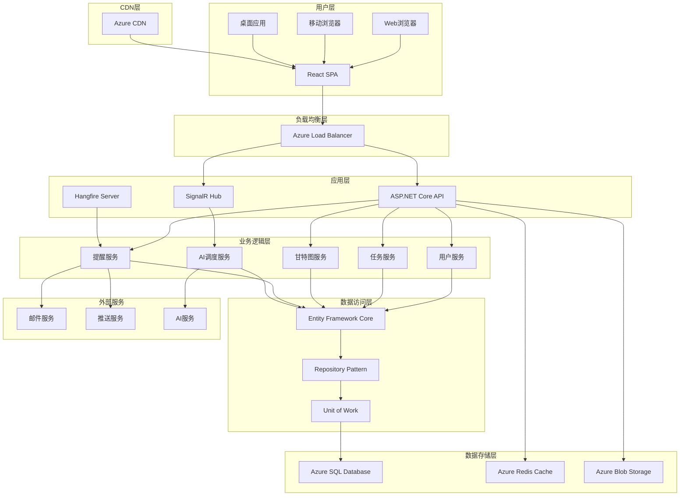

# 🏗️ ToDoListArea技术选型与架构设计

## 🔗 相关文档链接

- [文档体系主索引](./00_文档体系主索引.md) - 查看完整文档体系
- [项目章程与需求规格书](./01_项目章程与需求规格书.md) - 查看业务需求
- [详细设计规格书](./04_详细设计规格书.md) - 查看系统详细设计
- [开发实施指南](./06_开发实施指南.md) - 查看具体实施步骤

## 📋 目录

- [技术选型分析](#技术选型分析)
- [系统架构设计](#系统架构设计)
- [技术架构演进](#技术架构演进)
- [关键技术决策](#关键技术决策)
- [风险评估与缓解](#风险评估与缓解)
- [技术债务管理](#技术债务管理)

---

## 🔧 技术选型分析

### 📊 技术选型对比矩阵

#### 后端框架选型

| 框架 | 学习成本 | 性能 | 生态 | 企业支持 | 团队熟悉度 | 总分 | 选择 |
|------|----------|------|------|----------|------------|------|------|
| **ASP.NET Core** | 7 | 9 | 8 | 10 | 8 | 42 | ✅ |
| **Spring Boot** | 6 | 8 | 9 | 9 | 6 | 38 | ❌ |
| **Node.js + Express** | 8 | 6 | 8 | 6 | 7 | 35 | ❌ |
| **Django** | 7 | 7 | 7 | 7 | 5 | 33 | ❌ |

**选择理由**:
1. **企业级支持**: Microsoft提供完整的企业级支持和长期维护
2. **性能优势**: .NET 8.0在性能基准测试中表现优异
3. **生态完整**: 从开发工具到部署平台的完整生态系统
4. **类型安全**: 强类型语言提供更好的代码质量保障
5. **云原生**: 与Azure云服务深度集成

#### 前端框架选型

| 框架 | 学习成本 | 性能 | 生态 | 社区活跃度 | 企业采用率 | 总分 | 选择 |
|------|----------|------|------|------------|------------|------|------|
| **React 18** | 7 | 8 | 10 | 10 | 9 | 44 | ✅ |
| **Vue 3** | 8 | 8 | 8 | 9 | 7 | 40 | ❌ |
| **Angular 17** | 5 | 9 | 8 | 8 | 8 | 38 | ❌ |
| **Svelte** | 9 | 9 | 6 | 7 | 5 | 36 | ❌ |

**选择理由**:
1. **生态成熟**: 最丰富的组件库和工具链生态
2. **企业认可**: 大量企业级项目的成功实践
3. **性能优化**: React 18的并发特性提供更好的用户体验
4. **团队技能**: 团队对React技术栈最为熟悉
5. **长期支持**: Facebook/Meta的长期技术投入保障

#### 数据库选型

| 数据库 | 性能 | 可靠性 | 扩展性 | 运维成本 | 技术支持 | 总分 | 选择 |
|--------|------|--------|--------|----------|----------|------|------|
| **SQL Server** | 9 | 10 | 8 | 7 | 10 | 44 | ✅ |
| **PostgreSQL** | 8 | 9 | 9 | 8 | 8 | 42 | ❌ |
| **MySQL** | 7 | 8 | 7 | 9 | 8 | 39 | ❌ |
| **MongoDB** | 8 | 7 | 9 | 6 | 7 | 37 | ❌ |

**选择理由**:
1. **企业级特性**: 完整的企业级数据库功能和安全特性
2. **.NET集成**: 与Entity Framework Core深度集成
3. **Azure支持**: Azure SQL Database提供托管服务
4. **性能优化**: 先进的查询优化器和索引技术
5. **技术支持**: Microsoft提供专业的技术支持服务

### 🛠️ 技术栈详细说明

#### 前端技术栈
```
前端架构
├── 核心框架: React 18.2+ (并发特性, Suspense)
├── 类型系统: TypeScript 5.0+ (严格模式)
├── 构建工具: Vite 4.0+ (快速开发, HMR)
├── UI框架: TailwindCSS 3.3+ (原子化CSS)
├── 组件库: HeadlessUI 1.7+ (无样式组件)
├── 状态管理: Zustand 4.0+ (轻量状态管理)
├── 路由管理: React Router 6.8+ (声明式路由)
├── 数据获取: TanStack Query 4.0+ (服务端状态)
├── 表单处理: React Hook Form 7.0+ (性能优化)
├── 图表库: D3.js 7.0+ + Recharts 2.5+ (数据可视化)
├── 甘特图: @dhtmlx/trial 8.0+ (专业甘特图)
├── 富文本: React-Markdown 8.0+ (Markdown支持)
├── 测试框架: Vitest + React Testing Library
└── 代码质量: ESLint + Prettier + Husky
```

#### 后端技术栈
```
后端架构
├── 运行时: .NET 8.0 (LTS版本)
├── Web框架: ASP.NET Core 8.0 (高性能Web API)
├── ORM框架: Entity Framework Core 8.0 (Code First)
├── 数据库: SQL Server 2022 (企业版)
├── 认证授权: ASP.NET Core Identity + JWT
├── API文档: Swagger/OpenAPI 3.0
├── 缓存: Redis 7.0 (分布式缓存)
├── 消息队列: Hangfire 1.8+ (后台任务)
├── 日志框架: Serilog 3.0+ (结构化日志)
├── 对象映射: AutoMapper 12.0+ (DTO映射)
├── 验证框架: FluentValidation 11.0+ (业务验证)
├── 测试框架: xUnit + Moq + FluentAssertions
├── 代码分析: SonarQube + Roslyn Analyzers
└── 容器化: Docker + Docker Compose
```

#### 基础设施技术栈
```
基础设施
├── 云平台: Microsoft Azure (全托管)
├── 计算服务: Azure App Service (PaaS)
├── 数据库: Azure SQL Database (托管数据库)
├── 缓存服务: Azure Cache for Redis
├── 存储服务: Azure Blob Storage (文件存储)
├── CDN服务: Azure CDN (全球分发)
├── 监控服务: Application Insights (APM)
├── 安全服务: Azure Key Vault (密钥管理)
├── CI/CD: Azure DevOps + GitHub Actions
├── 容器服务: Azure Container Instances
├── API网关: Azure API Management (中后期)
└── 备份恢复: Azure Backup (数据保护)
```

### 📈 技术选型成本效益分析

#### 开发成本分析
| 技术栈 | 初期成本 | 学习成本 | 维护成本 | 扩展成本 | 总成本 |
|--------|----------|----------|----------|----------|--------|
| **当前选择** | 中 | 低 | 低 | 中 | **低** |
| **Java技术栈** | 中 | 中 | 中 | 低 | 中 |
| **Node.js技术栈** | 低 | 低 | 高 | 高 | 中 |
| **Python技术栈** | 低 | 中 | 中 | 中 | 中 |

#### 风险评估
| 风险类型 | 风险等级 | 缓解措施 |
|----------|----------|----------|
| **技术过时** | 低 | Microsoft长期支持保障 |
| **人才招聘** | 中 | .NET开发者市场充足 |
| **供应商锁定** | 中 | 开源替代方案可用 |
| **性能瓶颈** | 低 | 成熟的性能优化方案 |
| **安全风险** | 低 | 企业级安全特性完善 |

---

## 🏗️ 系统架构设计

### 📐 整体架构图



### 🔧 分层架构详细设计

#### 表示层 (Presentation Layer)
**职责**: 用户界面展示和交互处理
**技术**: React 18 + TypeScript + TailwindCSS
**组件**:
- **页面组件**: 路由级别的页面组件
- **业务组件**: 功能模块级别的组件
- **通用组件**: 可复用的UI组件
- **状态管理**: Zustand全局状态 + React Query服务端状态

#### API网关层 (API Gateway Layer)
**职责**: 请求路由、认证授权、限流熔断
**技术**: ASP.NET Core Middleware + Azure API Management
**功能**:
- **认证中间件**: JWT令牌验证
- **授权中间件**: 基于角色的权限控制
- **限流中间件**: API调用频率限制
- **日志中间件**: 请求响应日志记录
- **异常中间件**: 全局异常处理

#### 业务逻辑层 (Business Logic Layer)
**职责**: 核心业务逻辑实现和业务规则验证
**技术**: ASP.NET Core Services + FluentValidation
**服务**:
- **用户服务**: 用户管理、认证授权
- **任务服务**: 任务CRUD、搜索筛选
- **甘特图服务**: 时间线计算、依赖分析
- **提醒服务**: 提醒规则、通知发送
- **AI服务**: 智能调度、冲突检测

#### 数据访问层 (Data Access Layer)
**职责**: 数据持久化和数据访问抽象
**技术**: Entity Framework Core + Repository Pattern
**组件**:
- **DbContext**: 数据库上下文管理
- **Repository**: 数据访问接口抽象
- **Unit of Work**: 事务管理和工作单元
- **Entity**: 数据实体模型
- **Configuration**: 实体配置和映射

#### 数据存储层 (Data Storage Layer)
**职责**: 数据持久化存储和缓存
**技术**: Azure SQL Database + Redis + Blob Storage
**存储**:
- **主数据库**: 业务数据持久化存储
- **缓存数据库**: 热点数据缓存加速
- **文件存储**: 附件和静态资源存储
- **搜索引擎**: 全文搜索和复杂查询

### 🔄 数据流架构

#### 请求处理流程
```
用户请求 → CDN → 负载均衡 → API网关 → 业务服务 → 数据访问 → 数据库
         ↓
      缓存检查 → Redis缓存 → 缓存命中返回
         ↓
      缓存未命中 → 数据库查询 → 结果缓存 → 返回响应
```

#### 实时通信流程
```
用户操作 → React组件 → SignalR客户端 → SignalR Hub → 业务服务 → 数据库
         ↓
      广播通知 → 其他在线用户 → 实时UI更新
```

#### 后台任务流程
```
定时触发 → Hangfire调度器 → 后台任务 → 业务服务 → 外部服务
         ↓
      任务结果 → 数据库记录 → 用户通知
```

---

## 📈 技术架构演进

### 🎯 四阶段演进策略

#### MVP阶段 (0-3个月) - 单体架构
**目标**: 快速验证产品价值，支持1000用户
**架构特点**:
- 单体应用部署，简化运维复杂度
- 单一数据库，保证数据一致性
- 基础缓存策略，提升响应性能
- 简单监控方案，保障系统稳定

**技术栈**:
```
前端: React + TypeScript + Vite
后端: ASP.NET Core + EF Core + SQL Server
部署: Azure App Service + Azure SQL Database
监控: Application Insights基础监控
```

#### 初期阶段 (3-12个月) - 增强单体
**目标**: 功能完善，支持10万用户
**架构增强**:
- 引入Redis分布式缓存
- 添加Hangfire后台任务处理
- 集成AI服务和第三方API
- 完善监控和日志系统

**新增技术**:
```
缓存: Azure Cache for Redis
任务: Hangfire后台任务
AI: Azure OpenAI Service
监控: Azure Monitor + Application Insights
```

#### 中期阶段 (1-3年) - 微服务架构
**目标**: 规模化发展，支持100万用户
**架构转型**:
- 服务拆分为8个微服务
- 引入API网关和服务治理
- 实现数据库读写分离
- 建立完整的DevOps流水线

**微服务拆分**:
```
用户服务: 用户管理、认证授权
任务服务: 任务CRUD、搜索筛选
甘特图服务: 时间线计算、可视化
提醒服务: 通知发送、规则管理
AI服务: 智能调度、数据分析
文件服务: 附件管理、文件处理
通知服务: 消息推送、邮件发送
网关服务: 路由转发、限流熔断
```

#### 长期阶段 (3-5年) - 云原生架构
**目标**: 全球化部署，支持1000万用户
**架构升级**:
- 容器化部署和Kubernetes编排
- 多数据中心和全球CDN
- 大数据平台和机器学习
- 完整的云原生生态

**云原生技术**:
```
容器: Docker + Azure Kubernetes Service
服务网格: Istio Service Mesh
数据: Azure Cosmos DB + Azure Synapse
AI/ML: Azure Machine Learning Platform
监控: Azure Monitor + Prometheus + Grafana
```

### 📊 架构演进决策矩阵

| 阶段 | 用户规模 | 架构复杂度 | 开发成本 | 运维成本 | 技术风险 |
|------|----------|------------|----------|----------|----------|
| **MVP** | 1K | 低 | 低 | 低 | 低 |
| **初期** | 10万 | 中 | 中 | 中 | 中 |
| **中期** | 100万 | 高 | 高 | 高 | 中 |
| **长期** | 1000万 | 很高 | 很高 | 中 | 低 |

---

## 🔑 关键技术决策

### 🎯 技术决策记录 (ADR)

#### ADR-001: 选择ASP.NET Core作为后端框架
**状态**: 已接受
**决策日期**: 2025-07-29
**决策者**: 技术委员会

**背景**:
需要选择一个企业级的后端框架来支持ToDoListArea项目的长期发展。

**决策**:
选择ASP.NET Core 8.0作为后端开发框架。

**理由**:
1. **性能优势**: 在TechEmpower基准测试中表现优异
2. **企业支持**: Microsoft提供长期支持和企业级服务
3. **生态完整**: 从开发到部署的完整工具链
4. **类型安全**: 强类型语言减少运行时错误
5. **云集成**: 与Azure云服务深度集成

**后果**:
- 正面: 高性能、稳定性好、企业级支持
- 负面: 学习成本相对较高、Windows生态依赖

#### ADR-002: 选择React作为前端框架
**状态**: 已接受
**决策日期**: 2025-07-29
**决策者**: 前端团队

**背景**:
需要选择一个现代化的前端框架来构建复杂的用户界面。

**决策**:
选择React 18作为前端开发框架。

**理由**:
1. **生态成熟**: 最丰富的组件库和工具生态
2. **性能优化**: React 18的并发特性提升用户体验
3. **企业认可**: 大量企业级项目的成功实践
4. **团队熟悉**: 开发团队对React最为熟悉
5. **社区活跃**: 活跃的开源社区和持续更新

**后果**:
- 正面: 开发效率高、组件复用性好、社区支持强
- 负面: 包体积较大、学习曲线陡峭

#### ADR-003: 采用三层架构模式
**状态**: 已接受
**决策日期**: 2025-07-29
**决策者**: 架构师

**背景**:
需要设计一个清晰、可维护的系统架构来支持复杂的业务逻辑。

**决策**:
采用表示层、业务逻辑层、数据访问层的三层架构模式。

**理由**:
1. **职责分离**: 每层职责明确，便于维护和测试
2. **可扩展性**: 支持水平和垂直扩展
3. **技术无关**: 各层可以独立选择技术栈
4. **团队协作**: 不同团队可以并行开发不同层
5. **企业标准**: 符合企业级应用的架构标准

**后果**:
- 正面: 架构清晰、易于维护、支持团队协作
- 负面: 增加了系统复杂度、可能存在性能开销

### 🔧 技术选型权衡分析

#### 前端状态管理选择
**候选方案**:
1. **Redux Toolkit**: 功能强大，生态完善
2. **Zustand**: 轻量简洁，学习成本低
3. **Recoil**: Facebook官方，实验性特性

**选择结果**: Zustand + React Query
**权衡理由**:
- Zustand满足大部分状态管理需求，代码简洁
- React Query专门处理服务端状态，功能专业
- 组合使用避免了Redux的复杂性

#### 数据库ORM选择
**候选方案**:
1. **Entity Framework Core**: 微软官方，功能完整
2. **Dapper**: 轻量高性能，SQL控制精确
3. **NHibernate**: 功能强大，配置复杂

**选择结果**: Entity Framework Core
**权衡理由**:
- Code First开发模式提高开发效率
- 与ASP.NET Core深度集成
- 自动迁移和数据库同步
- 强类型查询和LINQ支持

---

## ⚠️ 风险评估与缓解

### 🎯 技术风险识别

#### 高风险项目
| 风险项 | 风险等级 | 影响程度 | 发生概率 | 风险描述 |
|--------|----------|----------|----------|----------|
| **AI算法复杂度** | 高 | 高 | 中 | AI智能调度算法实现复杂，可能影响项目进度 |
| **甘特图性能** | 中 | 高 | 中 | 大量任务时甘特图渲染性能可能不足 |
| **实时同步** | 中 | 中 | 中 | 多用户实时协作的数据同步复杂度 |

#### 中风险项目
| 风险项 | 风险等级 | 影响程度 | 发生概率 | 风险描述 |
|--------|----------|----------|----------|----------|
| **第三方依赖** | 中 | 中 | 低 | 关键第三方库的稳定性和维护状态 |
| **数据库性能** | 中 | 中 | 低 | 大数据量时数据库查询性能瓶颈 |
| **安全漏洞** | 中 | 高 | 低 | 系统安全漏洞可能导致数据泄露 |

### 🛡️ 风险缓解策略

#### AI算法复杂度风险
**缓解措施**:
1. **分阶段实现**: 先实现基础冲突检测，再逐步增强AI功能
2. **外部服务**: 考虑使用Azure OpenAI等成熟AI服务
3. **降级方案**: 提供手动调整作为AI功能的备选方案
4. **原型验证**: 提前构建算法原型验证可行性

#### 甘特图性能风险
**缓解措施**:
1. **虚拟滚动**: 实现虚拟滚动技术处理大量任务
2. **数据分页**: 按时间范围分页加载甘特图数据
3. **缓存策略**: 缓存计算结果，避免重复计算
4. **性能监控**: 建立性能监控，及时发现瓶颈

#### 实时同步风险
**缓解措施**:
1. **冲突解决**: 设计完善的数据冲突解决机制
2. **增量同步**: 只同步变更的数据，减少网络开销
3. **离线支持**: 提供离线模式，网络恢复后同步
4. **版本控制**: 实现数据版本控制，支持回滚操作

### 📊 风险监控指标

| 风险类型 | 监控指标 | 阈值 | 监控频率 |
|----------|----------|------|----------|
| **性能风险** | API响应时间 | >500ms | 实时 |
| **可用性风险** | 系统可用率 | <99% | 每小时 |
| **安全风险** | 异常登录次数 | >100次/小时 | 实时 |
| **数据风险** | 数据库连接数 | >80% | 每分钟 |

---

## 💳 技术债务管理

### 📋 技术债务分类

#### 代码债务
- **重复代码**: 相似功能的重复实现
- **复杂方法**: 单个方法过于复杂，难以维护
- **命名不规范**: 变量和方法命名不符合规范
- **缺少注释**: 关键业务逻辑缺少必要注释

#### 架构债务
- **紧耦合**: 模块间耦合度过高
- **违反原则**: 违反SOLID等设计原则
- **技术选型**: 过时的技术选型需要升级
- **性能瓶颈**: 架构设计导致的性能问题

#### 测试债务
- **覆盖率不足**: 单元测试覆盖率低于标准
- **集成测试缺失**: 缺少必要的集成测试
- **测试数据**: 测试数据管理不规范
- **自动化不足**: 手动测试比例过高

### 🎯 债务管理策略

#### 债务识别
1. **代码审查**: 定期进行代码审查，识别潜在债务
2. **静态分析**: 使用SonarQube等工具自动检测
3. **性能监控**: 通过监控数据识别性能债务
4. **团队反馈**: 收集开发团队的债务反馈

#### 债务优先级
| 优先级 | 债务类型 | 处理策略 |
|--------|----------|----------|
| **P0** | 安全漏洞、性能瓶颈 | 立即修复 |
| **P1** | 架构违反、关键bug | 下个迭代修复 |
| **P2** | 代码重复、测试不足 | 计划修复 |
| **P3** | 命名规范、注释缺失 | 重构时修复 |

#### 债务偿还计划
- **每个迭代**: 分配20%时间用于技术债务偿还
- **专项重构**: 每季度安排专项重构周
- **持续改进**: 建立技术债务持续改进机制
- **度量跟踪**: 建立债务度量指标和跟踪机制

---

## 📝 变更记录

| 版本 | 日期 | 变更内容 | 变更人 | 审批人 |
|------|------|----------|--------|--------|
| v2.0 | 2025-07-29 | 企业级技术架构重构，完善技术选型分析和架构设计 | 架构团队 | 技术委员会 |
| v1.0 | 2025-07-26 | 初始技术架构文档创建 | 架构师 | 技术负责人 |

### 🔄 下次更新计划
- **计划日期**: 2025-08-12
- **更新内容**: 根据原型开发反馈优化架构设计
- **负责人**: 架构师

---

## 📊 技术选型成本分析

### 💰 总体拥有成本 (TCO)

#### 3年期成本预估
| 成本类别 | 年度成本 | 3年总成本 | 占比 |
|----------|----------|-----------|------|
| **开发许可** | ¥50,000 | ¥150,000 | 15% |
| **云服务费用** | ¥120,000 | ¥360,000 | 36% |
| **人力成本** | ¥400,000 | ¥1,200,000 | 60% |
| **培训成本** | ¥30,000 | ¥90,000 | 9% |
| **运维成本** | ¥80,000 | ¥240,000 | 24% |
| **总计** | ¥680,000 | ¥2,040,000 | 100% |

#### 成本优化策略
1. **云服务优化**: 使用Azure预留实例降低30%成本
2. **开源替代**: 部分组件使用开源方案降低许可成本
3. **自动化运维**: 减少人工运维成本
4. **性能优化**: 降低资源消耗和云服务费用

### 📈 投资回报分析 (ROI)

#### 技术投资收益
- **开发效率提升**: 30%开发时间节省
- **运维成本降低**: 40%运维工作量减少
- **系统稳定性**: 99.9%可用性保障
- **扩展性支持**: 支持10倍用户增长无需重构

#### 风险成本节省
- **安全风险**: 企业级安全特性降低数据泄露风险
- **技术风险**: 成熟技术栈降低项目失败风险
- **维护风险**: 标准化架构降低维护复杂度

---

**文档维护**: 本文档由架构团队维护，每月审查技术选型和架构设计
**技术决策**: 重大技术决策需要通过技术委员会审批
**版权声明**: 本文档为ToDoListArea项目内部文档，未经授权不得外传
