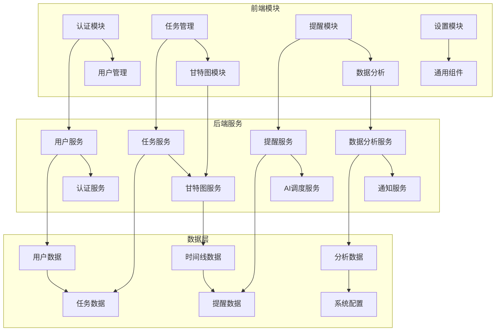
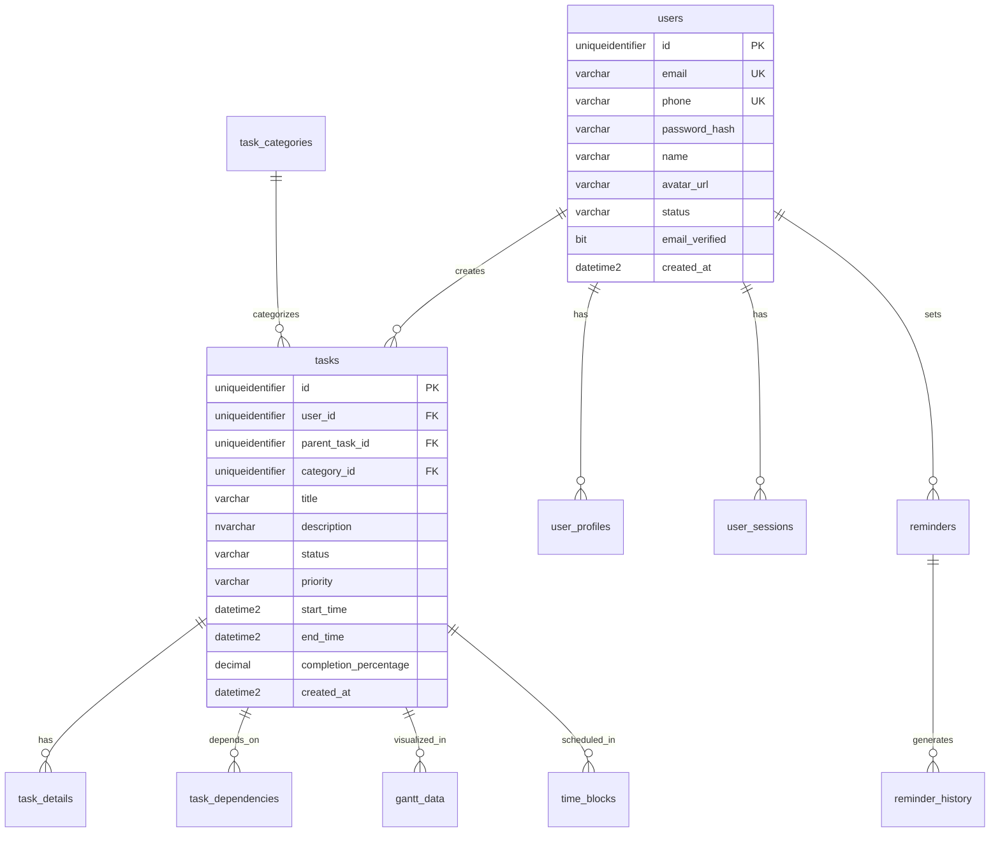

# 📐 ToDoListArea详细设计规格书

## 🔗 相关文档链接

- [文档体系主索引](./00_文档体系主索引.md) - 查看完整文档体系
- [技术选型与架构设计](./03_技术选型与架构设计.md) - 查看技术架构
- [API接口设计规范](./05_API接口设计规范.md) - 查看接口设计
- [开发实施指南](./06_开发实施指南.md) - 查看实施步骤

## 📋 目录

- [系统模块设计](#系统模块设计)
- [数据库设计](#数据库设计)
- [核心算法设计](#核心算法设计)
- [安全设计](#安全设计)
- [性能设计](#性能设计)
- [接口设计](#接口设计)

---

## 🧩 系统模块设计

### 📊 模块架构图



### 🔧 核心模块详细设计

#### 1. 用户认证模块
**模块职责**: 用户身份认证、权限管理、会话控制
**技术实现**: JWT + OAuth 2.0（当前实现状态：仅启用JWT；Identity未落地）

**核心类设计**:
```csharp
// 用户实体
public class User : IdentityUser<Guid>
{
    public string FirstName { get; set; }
    public string LastName { get; set; }
    public string AvatarUrl { get; set; }
    public string Timezone { get; set; }
    public string Language { get; set; }
    public bool IsActive { get; set; }
    public DateTime CreatedAt { get; set; }
    public DateTime UpdatedAt { get; set; }
    
    // 导航属性
    public virtual ICollection<Task> Tasks { get; set; }
    public virtual UserProfile Profile { get; set; }
}

// 认证服务接口
public interface IAuthService
{
    Task<AuthResult> RegisterAsync(RegisterRequest request);
    Task<AuthResult> LoginAsync(LoginRequest request);
    Task<AuthResult> RefreshTokenAsync(string refreshToken);
    Task<bool> LogoutAsync(string userId);
    Task<bool> ChangePasswordAsync(ChangePasswordRequest request);
}
```

**安全特性**:
- JWT令牌有效期24小时，刷新令牌7天
- 密码强度要求：8位以上，包含大小写字母、数字、特殊字符
- 支持多设备登录，最多5个活跃会话
- 异常登录检测和账户锁定机制

#### 2. 任务管理模块
**模块职责**: 任务CRUD操作、搜索筛选、分类管理、依赖关系
**技术实现**: Entity Framework Core + Repository Pattern

**核心类设计**:
```csharp
// 任务实体
public class Task
{
    public Guid Id { get; set; }
    public Guid UserId { get; set; }
    public Guid? ParentTaskId { get; set; }
    public Guid? CategoryId { get; set; }
    
    public string Title { get; set; }
    public string Description { get; set; }
    public TaskStatus Status { get; set; }
    public TaskPriority Priority { get; set; }
    
    public DateTime? StartTime { get; set; }
    public DateTime? EndTime { get; set; }
    public int? EstimatedDuration { get; set; }
    public int? ActualDuration { get; set; }
    
    public decimal CompletionPercentage { get; set; }
    public bool IsRecurring { get; set; }
    public string RecurrencePattern { get; set; }
    public string Tags { get; set; }
    
    public DateTime CreatedAt { get; set; }
    public DateTime UpdatedAt { get; set; }
    
    // 导航属性
    public virtual User User { get; set; }
    public virtual Task ParentTask { get; set; }
    public virtual ICollection<Task> SubTasks { get; set; }
    public virtual TaskCategory Category { get; set; }
}

// 任务服务接口
public interface ITaskService
{
    Task<TaskDto> CreateTaskAsync(CreateTaskRequest request);
    Task<TaskDto> UpdateTaskAsync(Guid taskId, UpdateTaskRequest request);
    Task<bool> DeleteTaskAsync(Guid taskId);
    Task<TaskDto> GetTaskAsync(Guid taskId);
    Task<PagedResult<TaskDto>> GetTasksAsync(TaskQueryRequest request);
    Task<List<TaskDto>> SearchTasksAsync(string keyword);
}
```

**业务规则**:
- 任务标题必填，最大255字符
- 开始时间不能晚于结束时间
- 子任务的时间范围必须在父任务范围内
- 任务删除采用软删除机制
- 支持批量操作，最多100个任务

#### 3. 甘特图模块
**模块职责**: 时间线可视化、任务依赖关系、拖拽交互
**技术实现**: D3.js + React + SignalR实时同步

**核心类设计**:
```csharp
// 甘特图数据实体
public class GanttData
{
    public Guid Id { get; set; }
    public Guid UserId { get; set; }
    public Guid TaskId { get; set; }
    
    public DateTime StartDate { get; set; }
    public DateTime EndDate { get; set; }
    public decimal Progress { get; set; }
    public string Dependencies { get; set; } // JSON格式
    public string Resources { get; set; } // JSON格式
    
    public DateTime CreatedAt { get; set; }
    public DateTime UpdatedAt { get; set; }
    
    // 导航属性
    public virtual User User { get; set; }
    public virtual Task Task { get; set; }
}

// 甘特图服务接口
public interface IGanttService
{
    Task<GanttChartDto> GetGanttDataAsync(Guid userId, DateTime startDate, DateTime endDate);
    Task<bool> UpdateTaskTimeAsync(Guid taskId, DateTime startTime, DateTime endTime);
    Task<ConflictCheckResult> CheckTimeConflictAsync(Guid userId, DateTime startTime, DateTime endTime);
    Task<List<TaskDto>> GetCriticalPathAsync(Guid userId);
}
```

**算法设计**:
- 关键路径算法：计算项目最短完成时间
- 冲突检测算法：检测任务时间重叠
- 依赖关系算法：验证任务依赖的合理性
- 资源分配算法：优化资源使用效率

#### 4. AI智能调度模块
**模块职责**: 冲突检测、智能调整、学习优化
**技术实现**: Azure OpenAI + 自定义算法

**核心类设计**:
```csharp
// AI调度服务接口
public interface IAIScheduleService
{
    Task<ConflictDetectionResult> DetectConflictsAsync(Guid userId);
    Task<List<ScheduleAdjustment>> GenerateAdjustmentsAsync(ConflictDetectionResult conflicts);
    Task<bool> ApplyAdjustmentAsync(Guid userId, ScheduleAdjustment adjustment);
    Task<ScheduleOptimizationResult> OptimizeScheduleAsync(Guid userId, OptimizationRequest request);
}

// 冲突检测结果
public class ConflictDetectionResult
{
    public List<TimeConflict> TimeConflicts { get; set; }
    public List<ResourceConflict> ResourceConflicts { get; set; }
    public List<DependencyConflict> DependencyConflicts { get; set; }
    public ConflictSeverity Severity { get; set; }
}

// 调度调整建议
public class ScheduleAdjustment
{
    public Guid TaskId { get; set; }
    public AdjustmentType Type { get; set; }
    public DateTime NewStartTime { get; set; }
    public DateTime NewEndTime { get; set; }
    public string Reason { get; set; }
    public decimal ConfidenceScore { get; set; }
}
```

**AI算法设计**:
- 遗传算法：全局优化任务调度
- 启发式算法：快速冲突解决
- 机器学习：用户行为模式学习
- 强化学习：调度策略持续优化

---

## 🗄️ 数据库设计

### 📊 数据库架构图



### 🔧 核心表设计

#### 用户管理表组
**users表** - 用户基本信息
```sql
CREATE TABLE users (
    id UNIQUEIDENTIFIER PRIMARY KEY DEFAULT NEWID(),
    email VARCHAR(255) UNIQUE NOT NULL,
    phone VARCHAR(20) UNIQUE,
    password_hash VARCHAR(255) NOT NULL,
    name VARCHAR(100) NOT NULL,
    avatar_url NVARCHAR(MAX),
    status VARCHAR(20) NOT NULL DEFAULT 'active',
    email_verified BIT NOT NULL DEFAULT 0,
    phone_verified BIT NOT NULL DEFAULT 0,
    last_login_at DATETIME2,
    created_at DATETIME2 NOT NULL DEFAULT GETDATE(),
    updated_at DATETIME2 NOT NULL DEFAULT GETDATE()
);

-- 索引设计
CREATE INDEX idx_users_email ON users(email);
CREATE INDEX idx_users_status ON users(status);
CREATE INDEX idx_users_created_at ON users(created_at);
```

**user_profiles表** - 用户详细资料
```sql
CREATE TABLE user_profiles (
    id UNIQUEIDENTIFIER PRIMARY KEY DEFAULT NEWID(),
    user_id UNIQUEIDENTIFIER NOT NULL,
    first_name VARCHAR(100),
    last_name VARCHAR(100),
    timezone VARCHAR(50) NOT NULL DEFAULT 'UTC',
    language VARCHAR(10) NOT NULL DEFAULT 'zh-CN',
    date_format VARCHAR(20) NOT NULL DEFAULT 'YYYY-MM-DD',
    time_format VARCHAR(10) NOT NULL DEFAULT '24h',
    notification_preferences NVARCHAR(MAX),
    theme_preferences NVARCHAR(MAX),
    created_at DATETIME2 NOT NULL DEFAULT GETDATE(),
    updated_at DATETIME2 NOT NULL DEFAULT GETDATE(),
    
    FOREIGN KEY (user_id) REFERENCES users(id) ON DELETE CASCADE
);
```

#### 任务管理表组
**tasks表** - 任务核心信息
```sql
CREATE TABLE tasks (
    id UNIQUEIDENTIFIER PRIMARY KEY DEFAULT NEWID(),
    user_id UNIQUEIDENTIFIER NOT NULL,
    parent_task_id UNIQUEIDENTIFIER,
    category_id UNIQUEIDENTIFIER,
    title VARCHAR(255) NOT NULL,
    description NVARCHAR(MAX),
    status VARCHAR(20) NOT NULL DEFAULT 'pending',
    priority VARCHAR(10) NOT NULL DEFAULT 'medium',
    start_time DATETIME2,
    end_time DATETIME2,
    estimated_duration INTEGER,
    actual_duration INTEGER,
    completion_percentage DECIMAL(5,2) NOT NULL DEFAULT 0.00,
    is_recurring BIT NOT NULL DEFAULT 0,
    recurrence_pattern NVARCHAR(MAX),
    tags NVARCHAR(MAX),
    attachments NVARCHAR(MAX),
    completed_at DATETIME2,
    created_at DATETIME2 NOT NULL DEFAULT GETDATE(),
    updated_at DATETIME2 NOT NULL DEFAULT GETDATE(),
    
    FOREIGN KEY (user_id) REFERENCES users(id) ON DELETE CASCADE,
    FOREIGN KEY (parent_task_id) REFERENCES tasks(id) ON DELETE NO ACTION,
    FOREIGN KEY (category_id) REFERENCES task_categories(id) ON DELETE SET NULL
);

-- 复合索引设计
CREATE INDEX idx_tasks_user_status_priority ON tasks(user_id, status, priority);
CREATE INDEX idx_tasks_time_range ON tasks(start_time, end_time);
CREATE INDEX idx_tasks_parent ON tasks(parent_task_id);
```

### 📈 数据库性能优化

#### 索引策略
1. **主键索引**: 所有表使用UNIQUEIDENTIFIER主键
2. **唯一索引**: 邮箱、手机号等唯一字段
3. **复合索引**: 常用查询条件的组合索引
4. **覆盖索引**: 包含查询所需所有字段的索引
5. **分区索引**: 大表按时间分区的索引

#### 查询优化
1. **分页查询**: 使用OFFSET/FETCH进行高效分页
2. **条件筛选**: 在WHERE子句中使用索引字段
3. **连接优化**: 合理使用INNER/LEFT JOIN
4. **子查询优化**: 避免相关子查询，使用EXISTS
5. **统计信息**: 定期更新表统计信息

#### 数据归档策略
1. **历史数据**: 6个月以上的数据迁移到历史表
2. **日志数据**: 3个月以上的日志数据压缩存储
3. **删除数据**: 软删除数据定期物理删除
4. **备份策略**: 每日增量备份，每周全量备份

---

## 🧮 核心算法设计

### 🎯 AI智能调度算法

#### 冲突检测算法
```csharp
public class ConflictDetectionAlgorithm
{
    public ConflictDetectionResult DetectConflicts(List<Task> tasks)
    {
        var result = new ConflictDetectionResult();
        
        // 时间冲突检测
        for (int i = 0; i < tasks.Count; i++)
        {
            for (int j = i + 1; j < tasks.Count; j++)
            {
                if (HasTimeOverlap(tasks[i], tasks[j]))
                {
                    result.TimeConflicts.Add(new TimeConflict
                    {
                        Task1 = tasks[i],
                        Task2 = tasks[j],
                        OverlapDuration = CalculateOverlap(tasks[i], tasks[j])
                    });
                }
            }
        }
        
        // 依赖关系冲突检测
        result.DependencyConflicts = DetectDependencyConflicts(tasks);
        
        // 资源冲突检测
        result.ResourceConflicts = DetectResourceConflicts(tasks);
        
        return result;
    }
    
    private bool HasTimeOverlap(Task task1, Task task2)
    {
        return task1.StartTime < task2.EndTime && task2.StartTime < task1.EndTime;
    }
}
```

#### 智能调整算法
```csharp
public class ScheduleOptimizationAlgorithm
{
    public List<ScheduleAdjustment> OptimizeSchedule(List<Task> tasks, OptimizationGoal goal)
    {
        switch (goal)
        {
            case OptimizationGoal.MinimizeTime:
                return MinimizeProjectTime(tasks);
            case OptimizationGoal.BalanceWorkload:
                return BalanceWorkload(tasks);
            case OptimizationGoal.MaximizeEfficiency:
                return MaximizeEfficiency(tasks);
            default:
                return new List<ScheduleAdjustment>();
        }
    }
    
    private List<ScheduleAdjustment> MinimizeProjectTime(List<Task> tasks)
    {
        // 使用关键路径法优化项目时间
        var criticalPath = CalculateCriticalPath(tasks);
        var adjustments = new List<ScheduleAdjustment>();
        
        foreach (var task in criticalPath)
        {
            // 尝试并行化非关键路径任务
            var parallelTasks = FindParallelizableTasks(task, tasks);
            adjustments.AddRange(CreateParallelAdjustments(parallelTasks));
        }
        
        return adjustments;
    }
}
```

### 📊 甘特图渲染算法

#### 时间轴计算算法
```typescript
class GanttTimelineCalculator {
    calculateTimeline(tasks: Task[], viewType: ViewType): TimelineData {
        const timeline = {
            startDate: this.findEarliestDate(tasks),
            endDate: this.findLatestDate(tasks),
            timeUnits: this.calculateTimeUnits(viewType),
            taskBars: this.calculateTaskBars(tasks)
        };
        
        return timeline;
    }
    
    private calculateTaskBars(tasks: Task[]): TaskBar[] {
        return tasks.map(task => ({
            id: task.id,
            x: this.dateToPixel(task.startTime),
            width: this.durationToPixel(task.duration),
            y: this.taskToRow(task),
            height: this.getBarHeight(),
            color: this.getTaskColor(task.priority),
            dependencies: this.calculateDependencyLines(task)
        }));
    }
    
    private calculateDependencyLines(task: Task): DependencyLine[] {
        return task.dependencies.map(dep => ({
            fromX: this.dateToPixel(dep.fromTask.endTime),
            fromY: this.taskToRow(dep.fromTask),
            toX: this.dateToPixel(task.startTime),
            toY: this.taskToRow(task),
            type: dep.type
        }));
    }
}
```

### 🔍 搜索算法优化

#### 全文搜索算法
```csharp
public class TaskSearchService
{
    public async Task<List<TaskDto>> SearchTasksAsync(string keyword, SearchOptions options)
    {
        var query = _context.Tasks.AsQueryable();
        
        // 分词处理
        var keywords = TokenizeKeyword(keyword);
        
        // 多字段搜索
        query = query.Where(t => 
            keywords.Any(k => t.Title.Contains(k)) ||
            keywords.Any(k => t.Description.Contains(k)) ||
            keywords.Any(k => t.Tags.Contains(k))
        );
        
        // 相关性评分
        var results = await query
            .Select(t => new TaskSearchResult
            {
                Task = t,
                RelevanceScore = CalculateRelevanceScore(t, keywords)
            })
            .OrderByDescending(r => r.RelevanceScore)
            .Take(options.MaxResults)
            .ToListAsync();
        
        return results.Select(r => r.Task).ToList();
    }
    
    private decimal CalculateRelevanceScore(Task task, List<string> keywords)
    {
        decimal score = 0;
        
        foreach (var keyword in keywords)
        {
            // 标题匹配权重最高
            if (task.Title.Contains(keyword, StringComparison.OrdinalIgnoreCase))
                score += 10;
            
            // 描述匹配权重中等
            if (task.Description?.Contains(keyword, StringComparison.OrdinalIgnoreCase) == true)
                score += 5;
            
            // 标签匹配权重较低
            if (task.Tags?.Contains(keyword, StringComparison.OrdinalIgnoreCase) == true)
                score += 3;
        }
        
        return score;
    }
}
```

---

## 🔒 安全设计

### 🛡️ 身份认证安全

#### JWT令牌设计
```csharp
public class JwtTokenService
{
    public string GenerateAccessToken(User user)
    {
        var claims = new[]
        {
            new Claim(ClaimTypes.NameIdentifier, user.Id.ToString()),
            new Claim(ClaimTypes.Email, user.Email),
            new Claim(ClaimTypes.Name, user.UserName),
            new Claim("timezone", user.Profile?.Timezone ?? "UTC"),
            new Claim("language", user.Profile?.Language ?? "zh-CN")
        };
        
        var key = new SymmetricSecurityKey(Encoding.UTF8.GetBytes(_jwtSettings.SecretKey));
        var credentials = new SigningCredentials(key, SecurityAlgorithms.HmacSha256);
        
        var token = new JwtSecurityToken(
            issuer: _jwtSettings.Issuer,
            audience: _jwtSettings.Audience,
            claims: claims,
            expires: DateTime.UtcNow.AddHours(_jwtSettings.ExpirationHours),
            signingCredentials: credentials
        );
        
        return new JwtSecurityTokenHandler().WriteToken(token);
    }
}
```

#### 密码安全策略
```csharp
public class PasswordSecurityService
{
    public bool ValidatePasswordStrength(string password)
    {
        var requirements = new[]
        {
            password.Length >= 8,                           // 最少8位
            password.Any(char.IsUpper),                     // 包含大写字母
            password.Any(char.IsLower),                     // 包含小写字母
            password.Any(char.IsDigit),                     // 包含数字
            password.Any(c => "!@#$%^&*()".Contains(c))     // 包含特殊字符
        };
        
        return requirements.All(req => req);
    }
    
    public string HashPassword(string password)
    {
        return BCrypt.Net.BCrypt.HashPassword(password, BCrypt.Net.BCrypt.GenerateSalt(12));
    }
    
    public bool VerifyPassword(string password, string hash)
    {
        return BCrypt.Net.BCrypt.Verify(password, hash);
    }
}
```

### 🔐 数据安全保护

#### 敏感数据加密
```csharp
public class DataEncryptionService
{
    public string EncryptSensitiveData(string data)
    {
        using (var aes = Aes.Create())
        {
            aes.Key = Convert.FromBase64String(_encryptionSettings.Key);
            aes.IV = Convert.FromBase64String(_encryptionSettings.IV);
            
            using (var encryptor = aes.CreateEncryptor())
            using (var msEncrypt = new MemoryStream())
            using (var csEncrypt = new CryptoStream(msEncrypt, encryptor, CryptoStreamMode.Write))
            using (var swEncrypt = new StreamWriter(csEncrypt))
            {
                swEncrypt.Write(data);
                return Convert.ToBase64String(msEncrypt.ToArray());
            }
        }
    }
}
```

#### SQL注入防护
```csharp
public class SecureDataAccess
{
    public async Task<List<Task>> GetTasksByUserAsync(Guid userId, string searchTerm)
    {
        // 使用参数化查询防止SQL注入
        var sql = @"
            SELECT * FROM tasks 
            WHERE user_id = @userId 
            AND (title LIKE @searchTerm OR description LIKE @searchTerm)
            ORDER BY created_at DESC";
        
        var parameters = new[]
        {
            new SqlParameter("@userId", userId),
            new SqlParameter("@searchTerm", $"%{searchTerm}%")
        };
        
        return await _context.Tasks
            .FromSqlRaw(sql, parameters)
            .ToListAsync();
    }
}
```

---

## 📝 变更记录

| 版本 | 日期 | 变更内容 | 变更人 | 审批人 |
|------|------|----------|--------|--------|
| v2.0 | 2025-07-29 | 企业级详细设计重构，完善系统设计和数据库设计 | 技术团队 | 架构师 |
| v1.0 | 2025-07-26 | 初始详细设计文档创建 | 技术负责人 | 项目经理 |

### 🔄 下次更新计划
- **计划日期**: 2025-08-12
- **更新内容**: 根据开发进展优化设计细节
- **负责人**: 技术负责人

---

**文档维护**: 本文档由技术团队维护，每两周审查设计实现情况
**设计变更**: 重大设计变更需要通过技术评审委员会
**版权声明**: 本文档为ToDoListArea项目内部文档，未经授权不得外传
